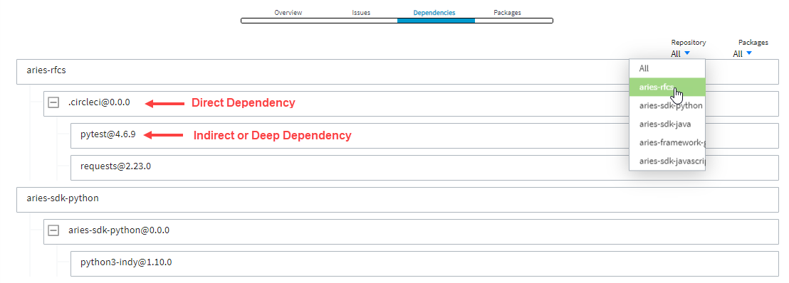

# Projects

Projects are either member projects of a foundation or standalone projects. If you select a project of interest to know more, the project page opens. Based on availability, following are the components shown for a project:

* [Dashboard](./#dashboard)
* [Security](./#security)

## Dashboard 

### Overview 

Overview shows the logo and description of a project. Hover mouse over the  icon to add to and remove a project from favorite list.

​ 

## Security 

​[&lt;&lt;Company Dashboard](https://docs.linuxfoundation.org/community-bridge/company/dashboard#security)​

The Security page provides detail information of the issues based on their severity, related packages and dependencies. You can click a project from the foundation drop-down list to select a project of interest.

Project Security

Following are the various dashboards of a project's security page:

* [Overview](./#overview)
* [Issues](./#issues)
* [Dependencies](./#dependencies)
* [Packages](./#packages)

### Overview 

Overview shows:

* A table that shows the number dependency issues in the repositories of the project based on their severity—High, Medium, and Low, and the number of fixable issues.
* A graph shows a timeline of when security issues occurred and how many issues occurred at a certain time. Lines and icons in the timeline are colored to represent the severity levels. Hover mouse over the graph to see the number of issues for a calendar month. You can select a year from the drop-down to filter the graph value.

### Issues 

Issues shows all the issues along with their severity levels with the following details for each issue:

* Overview: Description of the issue
* Remediation: What needs to be fixed for the issue
* References: Links to the corresponding PRs, issues, commits, and so on

A card on the right side provides a CWE-\# link, CVE-\# link, status of the issue, if the issue is fixable, and a Snyk ID. The CWE \([Common Weakness Enumeration](https://cwe.mitre.org/)\) website or \([Common Vulnerabilities and Exposures](https://cve.mitre.org/)\) website shows an identifier and details for the vulnerability by an identifier. Read the details to understand and remediate the issue, for example, by applying a Synk patch.

You can select values from drop-down lists on the top right corner to view only issues based on filter values.

### Dependencies 

Dependencies lists an inventory of repositories and its associated dependencies used in the project, and helps you gain insight into various aspects of your repository dependencies. Click dependency under a repository to go to the Issues dashboard to find out more information about a dependency. Click a repository to view the direct and deep \(indirect\) dependencies in the repository in a tree format:

* **Direct Dependencies:** A direct dependency is a package that you have included in your own repository.
* **Indirect/Deep Dependencies:** A indirect or dependency is a package that you are not using directly, but one that is used by one of your direct dependencies. For example, if your application is using package A, and package A is using package B, then your application is indirectly depending on package B. And if package B is vulnerable, your project is vulnerable.

You can sort dependencies for a repository and package by selecting a value from the Repository and Packages drop-down lists.

### Packages 

Shows a table that lists all the vulnerable packages and its related packages in alphabetical order along with version number, license number, repository link, number of issues based on severity, such as **H** \(High\), **M \(**Medium\), and **L** \(Low\), and total number issues for all the packages. Expand a package to see the related packages. When you click a package, it takes you to the Issues tab where you can see the issue details related to the package.

**Note:** Version with status as **Multiple** has one or more related packages.

Following are some functionalities on the dashboard:

* Clicking a package takes you to the Issues dashboard where you can see all the information related to the package.
* Clicking a license filters the table values as per the selected license. You will get the packages, related dependencies, and repository link for the filtered license.
* Clicking a repository link takes you to the Issues dashboard where you can see issues and its details associated with the repository.

You can sort the values in ascending and descending order by clicking any of the table header. You can select values from **Repositories** and **Group By** drop-down lists to filter packages and licenses.

​

