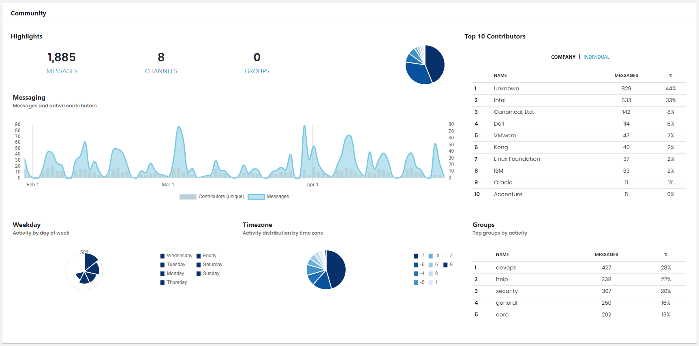
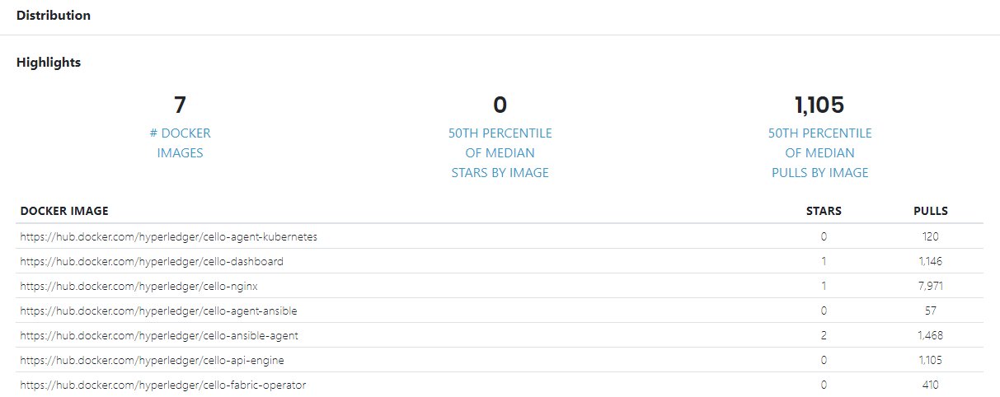

# Summary


By default, Bot commit is filtered, and can't be included for Summary dashboard.


Summary provides a high-level metrics about each data source for which the project is configured. Following are examples of some data sources for a project:

**Highlights** shows the total number of repositories, contributors, and commits for the project for  a selected time range. Following is an example of Highlights section:

**Code** shows overview analytics of project commits and contributors for a selected time range:

* **Highlights** shows the number of contributors and organizations associated with the project.
* **Commits** shows a stacked area chart that compares the number of commits and contributors per calendar period. The total number of commits and contributor values are color-coded. Hover mouse over the graph to see the numbers for a particular date. Click **Commits** or **Contributors** to eliminate the corresponding data, for example: . Click the caption again to include the data.
* **Top 10 Contributors** lists the top-ten contributors—Individuals and Organizations— to the project by name, total number of lines of codes that includes lines of codes added plus modified, number of commits, and percentage of commits out of the total number of commits by the community. This percentage calculation does not include empty commits and commits by bot. Click **COMPANY** or **INDIVIDUAL** to show the corresponding commit data.  A pie chart shows proportional data for the total number of commits per company or individual as a slice of the pie. The pie chart data corresponds to your Contributors selection: COMPANY or INDIVIDUAL. 

Mouse over a slice to show the number of commits and the company or individual name.

Following is an example of code overview section:

**Project Management** shows overview analytics of project issues, their statuses, and contributors of a project for a selected time range:

* **Highlights** shows the total number of issues related to the issue management platforms of the project, submitters, and assignees of the issues for a project.
* **Top 10 Contributors** lists the top ten contributors—Individuals and Organizations— of the project by name, total number of issues, and percentage of issues out of the total number of commits by the community. Click **COMPANY** or **INDIVIDUAL** to show the corresponding issue data. A pie chart shows proportional data for the total number of issues per company or individual as a slice of the pie. The pie chart data corresponds to your Contributors selection: COMPANY or INDIVIDUAL. Mouse over a slice to show the number of issues and the company or individual name.
* **Issues** shows a stacked area chart that compares the number of issues and unique contributors per calendar period. The number of issues and unique contributors for the project during each period are color-coded. Hover mouse over the graph to see the numbers for a particular date. Click **Contributors \(unique\)** or **Issues** to eliminate the corresponding data, for example. Click the caption again to include the data.
* **Status** shows a table that summarizes the issues by status depending on the management tool, such as GitHub and Jira. It shows the total number of issues per status for the project, and the percentage of the  issue status out of the total number of issues as mentioned in the highlight section.

Following an example of Project Management overview section for a project that uses Jira to manage issues:

**Community** shows an overview analytics of the communication mediums used by a project for a selected time range:

For Slack and/or Groups.io communication mediums:

* **Highlights** shows total number of messages shared across the communication mediums, total number of channels and groups created for communication.
* **Messaging** shows a stacked area chart that compares the number of messages and unique contributors per calendar period. Hover mouse over the graph to see the numbers for a particular date. The number of messages and unique contributors for the project during each period are color-coded. Click **Contributors \(unique\)** or **Messages** to eliminate the corresponding data, for example  . Click the caption again to include the data.
* **Top 10 Contributors** lists the top ten contributors—Individuals and Organizations— of the project by name, total number of messages contributed by an individual or an organization, and percentage of messages out of the total number of messages shared by the community. Click **COMPANY** or **INDIVIDUAL** to show the corresponding messaging data. A pie chart shows proportional data for the total number of messages per company or individual as a slice of the pie. The pie chart data corresponds to your Contributors selection: COMPANY or INDIVIDUAL. Mouse over a slice to show the number of issues and the company or individual name.
* **Weekday** shows a pie chart that represents the total number of messages shared by the community on a particular day, based on the selected time range. This pie chart is marked with numbers such as 500 and 1000 as milestones indicating the highest number of message counts shared by the contributors.
* **Timezone** shows a pie chart that represents the total number of messages shared by the community members based on their Coordinated Universal Time \(UTC\) time zone. The numbers from 0 through -9, and so on are considered as hours. For example, number 8 indicates UTC + 8 hrs timezone.
* **Groups** lists the name of groups created, total number of messages per group, and percentage of messages out of the total number of messages shared by the community.

For Mailing List communication medium:

* **Highlights** shows total number of emails shared by the community members, total number of e-mail lists created for communication.
* **Messaging** shows a stacked area chart that compares the number of emails and unique contributors per calendar period. Hover mouse over the graph to see the numbers for a particular date. The number of e-mails and unique contributors of the project during each period are color-coded. Click **Contributors \(unique\)** or **Emails** to eliminate the corresponding data, for example  . Click the caption again to include the data.
* **Top 10 Contributors** lists the top ten contributors—Individuals and Organizations— of the project by name, total number of e-mails sent and received by an individual or an organization, and percentage of e-mails out of the total number of e-mails shared by the community. Click **COMPANY** or **INDIVIDUAL** to show the corresponding messaging data. A pie chart shows proportional data for the total number of e-mails per company or individual as a slice of the pie. The pie chart data corresponds to your Contributors selection: COMPANY or INDIVIDUAL. Mouse over a slice to show the number of issues and the company or individual name.
* **Weekday** shows a pie chart chart that represents the total number of e-mails shared by the community members on a particular day, based on the selected time range. This pie chart is marked with numbers such as 500 and 1000 as milestones indicating the highest number of message counts shared by the contributors
* **Timezone** shows a pie chart that represents the total number of messages shared by the community members based on their Coordinated Universal Time \(UTC\) time zone. The numbers from 0 through -9, and so on are considered as hours. For example, number 8 indicates UTC + 8 hrs timezone.
* **Lists** shows the name of e-mail lists created, total number of e-mails per list, and percentage of e-mails out of the total number of e-mails shared by the community members.

**Technical Management** shows an overview analytics of the number of servers, jobs, and build numbers of a project over time. Following is an example of Distribution overview section

**Distribution** shows overview analytics of container images of the project repository for a selected time range:

* **Highlights** shows ****total number of container images, 50th percentile of median stars and pulls by images.
* A table lists docker image links, total number of starts and pulls for an image.

Following is an example of Distribution overview section:

**Documentation** shows an overview analytics of project's confluence pages for a selected time range. It shows total number of confluence pages created/edited, total number comments in the form of feedback or conversation on confluence pages, and total number of editors who contributed to create/edit or provide feedback/comment on the confluence pages.

Following is an example of Documentation overview section:

