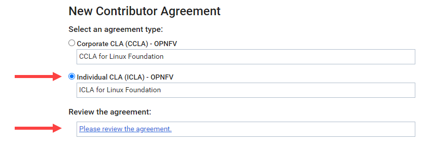
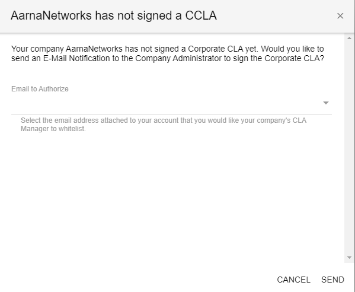
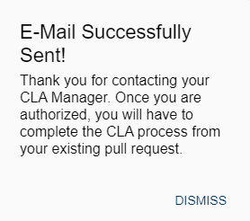

# Contribute to a Corporate Gerrit Project

As an individual contributor or a corporate \(employee\) contributor or to an open source project, you submit changed code in Gerrit to inform reviewers about the changes:

* As an individual contributor to an open-source project who is not associated to a company, you submit code in Gerrit and during the process, your CLA is verified. Also during the process, you click a link to open the CLA Contributor Console to sign the CLA Agreement. As an individual contributor, your work is owned by yourself \(Individual CLA\).
* If any of your contributions to the project are created as part of your employment, the work may not belong to you—it may be owned by your employer. In that case, the CCLA signatory represents the employer \(company\) for legal reasons, and signs the Corporate Contributor Licensing Agreement in order for your contribution to be accepted into the company. During the code submission process, your CLA status is verified.

  When all CLA management set-up tasks are complete and your CCLA signatory has signed a Corporate CLA, you simply confirm your association to the company during your first code submission. Then, you can continue. Your subsequent contributions will not require association confirmations.

**Do these steps:**

_If you are a project manager, make sure that you are logged out of the CLA Management Console before you begin._

1. In Gerrit, clone a repository under the Gerrit instance into your local machine.

2. Make a change and push the code to your Gerrit repository.

3. A warning link that you need to sign a CLA appears:

4. Navigate to the Gerrit instance of your project. For example, if you are contributing to OPNFV project, navigate to [https://gerrit.opnfv.org](https://gerrit.opnfv.org/)​

5. Sign in using your [Single Sign-On \(SSO\)](../../../sso/) account.

6. Navigate to **Settings**— the gear icon on the upper right corner, and click **Agreements** from the menu on the left:

​​    ​​

7. Click **New Contributor Agreement**.

8. New Contributor Agreement types appear:

9. Continue to contribute as an individual or employee \(corporate contributor\):

* [Individual Contributor](contribute-to-a-corporate-gerrit-project.md#individual-contributor)
* [Corporate Contributor](contribute-to-a-corporate-gerrit-project.md#corporate-contributor)

## Individual Contributor 

EasyCLA presents a review agreement link to individual contributors to open a CLA and sign it.

1. Select an individual CLA type.

2. Click the **Please review the agreement link** and then click the message link that appears:

3. Sign in to EasyCLA if you are prompted.

4. Wait for the OPEN CLA button to be activated, and click **OPEN CLA** on the dialog that appears:  
DocuSign presents the agreement that you must sign. The Individual CLA is not tied to any employer you may have, so enter your @personal address in the E-Mail field.

5. Follow the instructions in the DocuSign document, sign it, and click **FINISH**.

You are redirected to Gerrit. Wait a few seconds for the CLA status to update.

## Corporate Contributor 

EasyCLA presents a review agreement link where you confirm your association with the company.

1. Select **Corporate CLA**.

2. Click the **Please review the agreement link** and then click the message link that appears:

3. Sign in to EasyCLA if you are prompted.

4. Select **Company**.  
**Note:** To contribute to this project, you must be authorized under a signed Contributor License Agreement. You are contributing on behalf of your work for a company.

5. Continue:

* [If a **Confirmation of Association with** statement appears](contribute-to-a-corporate-gerrit-project.md#if-a-confirmation-of-association-with-statement-appears)
* [If a **Company has not signed CCLA** window appears](contribute-to-a-corporate-gerrit-project.md#if-a-company-has-not-signed-ccla-window-appears)
* [If You are not authorized](contribute-to-a-corporate-gerrit-project.md#if-you-are-not-whitelisted)
* [If Company is not in the list](contribute-to-a-corporate-gerrit-project.md#if-company-is-not-in-the-list)

## If a **Confirmation of Association with** statement appears 

1. Read the Confirmation of Association statement and select the checkbox.

2. Click **CONTINUE**.

A dialog appears and informs you: You are done!

3. Click **RETURN TO REPO**.

You are redirected to Gerrit. Wait a few seconds for the CLA status to update or refresh the page.

## If a **Company has not signed CCLA** window appears 

This window appears if your comapny has not signed a Corporate CLA for the project.

To send an email notification to your company's CLA manager to sign Corporate CLA:

1. Select your email address from the **Email to Authorize** drop-down list. This is the email address that you want your company manager to include in the approved list while signing the Corporate CLA.

2. Click **SEND**.

A message shows that your email is successfully sent.

## If You are not authorized 

This window appears if your company has not authorized you or has not included your name in the approved list under their signed Corporate CLA.

To send a request to your company's CLA manager to be authorized:

1. Click **CONTACT**.

2. A **Request Access** window appears.

3. Select your email address from the **Email to Authorize** drop-down list. This is the email address that you want your company manager to include in the approved list while signing the Corporate CLA.

4. Click **SEND**.

A message shows that your email is successfully sent.

## If Company is not in the list 

If you don't find your company's name in the list:

1. Click **COMPANY NOT IN LIST? CLICK HERE**.

   The **Verify Your Permission of Access** dialog appears.

2. Click an answer: Are You a CLA Manager?

   **YES**— You will be redirected to [corporate.lfcla.com](https://corporate.lfcla.com/#/companies) to [add your company](../cla-managers/add-a-company-to-a-project.md) to a project.

   **NO**— A Request Access form appears. Continue to next step.

3. Complete the form and click **SEND**.

   The CCLA manager signs a Corporate CLA and adds you to the approved list.

You have finished signing your CLA for this Gerrit instance. You are able to submit your changes to any repository under this Gerrit instance.

