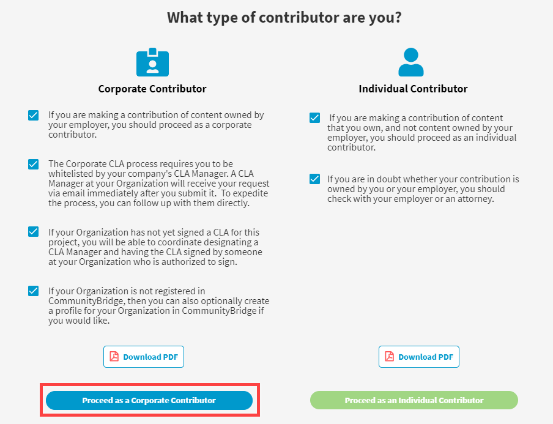
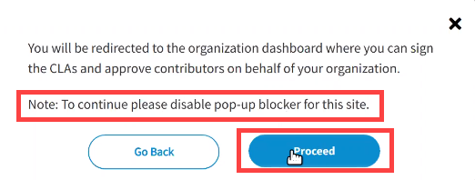
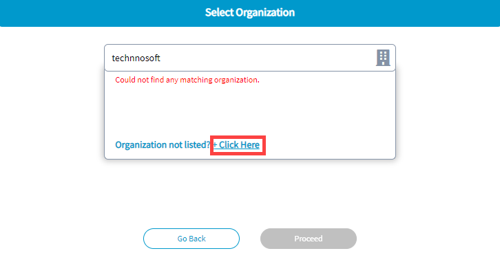

# Contribute to a Corporate GitHub  Project

As a corporate \(employee\) contributor to an open-source project, you create a pull request in GitHub to inform code maintainers about changes made to the code. If any of your contributions to the project are created as part of your employment, the work may not belong to you—it may be owned by your employer. In that case, the CCLA signatory represents the employer \(company\) for legal reasons, and signs the Corporate Contributor Licensing Agreement \(CCLA\) in order for your contribution to be accepted by the company. During the pull request process, your CLA status is verified.

When all CLA management set-up tasks are complete and your CCLA signatory has signed a Corporate CLA, you simply confirm your association to the company during your first pull request. Then you can continue with your pull request. Your subsequent contributions will not require association confirmations.

**Do these steps:**

1. In GitHub, go to the repository that is linked to the project for your organization.

2. Make a change and send a pull request.

3. EasyCLA checks the CLA status of all committers involved in that pull request.


1. EasyCLA marks a cross or a tick beside contributor names involved in that pull request based on their CLA status.
2. A cross next to your contributor name means the CLA check failed.


4. Click   or **Please click here to be authorized**.  
**Note:** The Authorize CommunityBridge: EasyCLA dialog appears.

5. Click **Authorize LF-Engineering**. \(Subsequent contributions will not require authorization.\)

**Result:** The CLA Contributor Console appears in a new tab.

​​

6. Click **Proceed as a Corporate Contributor**.   
**Note:** To contribute to this project, you must be authorized under a signed Contributor License Agreement. You are contributing your work on behalf of a company.

7. On **Select Your Organization** window, type organization name in the field, select the organization from the drop-down list, and click **Proceed**.

**Note:** If your company is not in the list, you can add the company as described in [If Company is not in the list](contribute-to-a-corporate-github-project.md#if-the-select-company-dialog-appears-1).

8. Continue:

* [If you are not added to the approved list](contribute-to-a-corporate-github-project.md#if-you-are-not-added-to-the-approved-list)
* [If you are added to the approved list](contribute-to-a-corporate-github-project.md#if-you-are-added-to-the-approved-list)
* [If you are asked to sign ICLA](contribute-to-a-corporate-github-project.md#if-you-are-asked-to-sign-icla)
* [If Company has not signed CLA](contribute-to-a-corporate-github-project.md#if-the-select-company-dialog-appears)
* [If Company is not in the List](contribute-to-a-corporate-github-project.md#if-the-select-company-dialog-appears-1)

## If you are not added to the approved list

If your company has signed CLA, but you are not added to the approved list, **Request Authorization to Contribute** window appears that shows the CLA manager\(s\) for your company.

1. Select CLA manager\(s\) from the drop-down list whom you want to request for authorizing you to contribute.

* **Go Back:** Takes you to the previous screen.
* **Exit EasyCLA:** Cancels the CLA signing process.

2. Click **Request Authorization**.  
A dialog appears and informs you: Request Submitted ​

3. Click **Exit EasyCLA**.  
_****_The CLA  manager adds you to the approved list.


You will receive an email notification if the CLA manager approves or rejects your request to be approved as a corporate contributor for the company.


## If you are added to the approved list

1. Based on the CLA configuration, you will be asked to [sign individual CLA](contribute-to-a-corporate-github-project.md#if-you-are-asked-to-sign-icla) if the CLA requires corporate contributors to sign individual CLA.

2. An acknowledgement window appears informing you that you have completed the contribution acknowledgement.  
  

2. Click **Exit EasyCLA**.

Navigate to the GitHub tab. Wait a few seconds for the CLA status to update or refresh the page.

4. Click **Merge pull request** and confirm the merge.

## If you are asked to sign ICLA

1. If you are added to the approved list, but your CLA requires you to sign Individual CLA \(ICLA\),  the following screen appears:  
  

2. Click **Proceed**.

3. On **CLA Ready For Signature** window, click **SIGN CLA**.  
  

4. Follow the instructions in the DocuSign document, sign it, and click **FINISH**.


* You receive an email from The Linux Foundation, informing you that you have signed the CLA. 
* You can download the PDF document by clicking the link form the email. You will be re-directed to Linux Foundation's website. If the download doesn't start automatically, click **Proceed to Download**.  


Navigate to the GitHub tab. Wait a few seconds for the CLA status to update or refresh the page. A tick appears next to your branch.

5. Click **Merge pull request**.

## If Company has not signed CLA 

If your company has not signed a CLA, **No Signed CLA Found** window appears.

1. Click an answer: **Are you authorized to be a CLA Manager for your organization?**

* [Yes](contribute-to-a-corporate-github-project.md#yes-if-you-are-authorized)
* [No](contribute-to-a-corporate-github-project.md#no-if-you-are-not-authorized)

### **Yes \(If you  are authorized\)**

1. A **Configuring CLA Manager Settings** window appears. 

2. After the configuration settings is completed, click **Proceed**.

3.  Click **Proceed** on the window that appears. Ensure that you disable pop-up blocker if you have enabled any as shown in the note.


**Important:** If you don't have a username \(LFID\) associated with Linux Foundation, you will be redirected to Linux Foundation page to create a username. After you create a username, you will be redirected back to corporate console where you can proceed with CLA signing.


4. You will be redirected to corporate console on a new tab **\(LINK TO BE PROVIDED\)** to [sign a CLA](../cla-manager-designee-or-initial-cla-manager/sign-corporate-cla-for-a-company.md).

After you successfully sign a CCLA, open the GitHub repository tab. A tick appears next to your branch or refresh the page. A notification appears:

5. Click **Merge pull request** and confirm the merge.

### **No \(If you are not authorized\)**

1. An **Identify CLA Manager** form appears.  
  

2. Complete the form, and click **Submit Request**, ****Or if you don't know email address of CLA Manager of your company, click **Contact Company Admin**.  
**Result:** A window appears confirming that request is submitted to respective individual who signs a Corporate CLA and adds you to the approved list.

3. Click **Exit EasyCLA**.  
You can contribute after the authorized representative signs a corporate CLA, and adds you to the approved list. 


You will receive an email after you are added to the approved list. After you are added, you [acknowledge the company contribution](contribute-to-a-corporate-github-project.md#if-you-are-added-to-the-approved-list) and/or [sign ICLA](contribute-to-a-corporate-github-project.md#if-you-are-asked-to-sign-icla) if the CLA is configured for you to sign ICLA before you can contribute to the project.


## If Company is not in the List 

1. Click **+Click Here** next to **Organization not listed?**

2. ****Provide organization name and website URL on **Enter Organization Details** window, and click **Next**.

3. A window appears confirming that the organization is successfully added.  
**Note:**  if the company is already added to the list, **Company Already Exists** window appears. You can search again to find the company.

4. Click **Proceed** to [sign a corporate CLA](../cla-manager-designee-or-initial-cla-manager/sign-corporate-cla-for-a-company.md).

