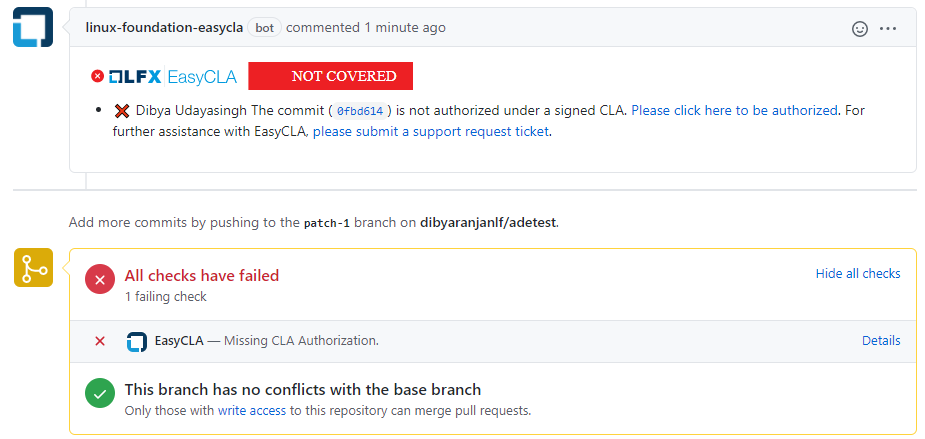
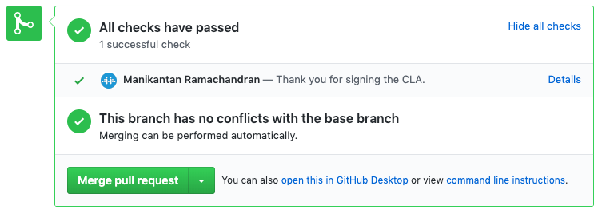

# Individual Contributor

As an individual contributor, you are contributing code on your own behalf \(not on behalf of an employer\). You create a pull request in GitHub or submit changed code in Gerrit to inform reviewers about the changes. During the process, your CLA is verified, and you must sign a CLA if you have not already signed, before you can contribute to GitHub or Gerrit.

* [GitHub](individual-contributor.md#github)
* [Gerrit](individual-contributor.md#gerrit)

## GitHub

1. In GitHub, go to the repository that is linked to the project for your organization.

2. Make a change and send a pull request.


1. EasyCLA checks the CLA status of all committers involved in that pull request. EasyCLA marks a cross or a tick beside contributor names who are involved in that pull request based on their CLA status.
2. A cross next to your contributor name means the CLA check failed.


3. Click  or **Please click here to be authorized**.

4. Click **Authorize LF-Engineering**. \(Subsequent contributions will not require this authorization.\)

​  ​

The CLA Contributor Console appears and shows the CLA group for your project.


**Note:** If the project is not configured for CCLA, then **Proceed as a** **Corporate Contributor** is not displayed.


5. Click **Proceed as an Individual Contributor**.  
**Result: Preparing CLA** window appears.  
  

 6. After **CLA is Ready For Signature** window appears, click **SIGN CLA** .

DocuSign presents the agreement that you must sign. The ICLA is not tied to any employer you may have, so enter your personal email address in the E-Mail field.

6. Select the checkbox, click **CONTINUE**,  and follow the instructions in the DocuSign document, sign it, and click **FINISH**.


**Result:**

* You receive an email from The Linux Foundation, informing you that you have signed the CLA. 
* You can download the PDF document by clicking the link form the email. You will be re-directed to Linux Foundation's website. If the download doesn't start automatically, click **Proceed to Download**.  


You are redirected to GitHub. Wait a few seconds for the CLA status to update. A tick appears next to your branch.

7. Click **Merge pull request** and confirm the merge.

The CLA is added to the project.

## Gerrit

1. In Gerrit, clone a repository under the Gerrit instance into your local machine.

2. Make a change and push the code to your Gerrit repository.

3. A warning link that you need to sign a CLA appears:

4. Navigate to the Gerrit instance of your project. For example, if you are contributing to OPNFV project, navigate to [https://gerrit.opnfv.org](https://gerrit.opnfv.org/)​

5. Sign in using your LF [Single Sign-On \(SSO\)](../../../sso/) account.

6. Navigate to **Settings**— the gear icon on the upper right corner, and click **Agreements** from the menu on the left:

​​    ​​

7. Click **New Contributor Agreement**.

8. Select **Individual CLA \(ICLA\)**, and click **Please review the agreement**.

9. Click **Proceed To Individual Authorization**.

10. Sign in if you are prompted, and you will be redirected to Contributor Console.

11. After CLA preparation is completed, click **Sign CLA**.

DocuSign presents the agreement that you must sign. The ICLA is not tied to any employer you may have, so enter your personal email address in the E-Mail field.

12. Select the checkbox, click **CONTINUE**,  and follow the instructions in the DocuSign document, sign it, and click **FINISH**.


**Result:**

* A message appears informing you that you have signed CLA.
* You receive an email from The Linux Foundation, informing you that you have signed the CLA. 
* You can download the PDF document by clicking the link from the email. You will be redirected to Linux Foundation's website. If the download doesn't start automatically, click **Proceed to Download**.  


You can now contribute to Gerrit as an individual. Navigate to the gerrit project, and start contributing.

