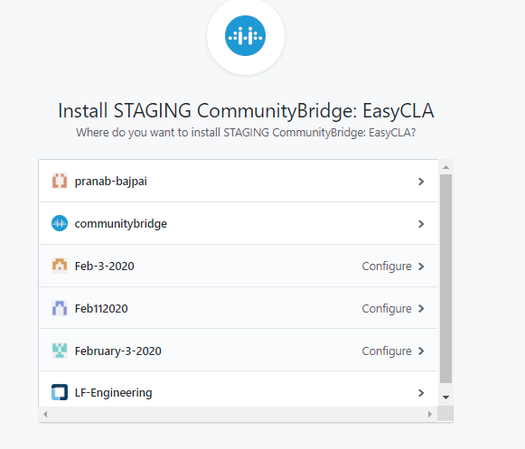

# Add and Manage Git Organizations and Repositories

Before you can add or manage git repositories, you must connect/add Git organizations while setting up IT services. However, you can also add GitHub organization in the GitHub pane and add Gerrit instance in the Gerrit pane of **Tools** tab.

* [Add GitHub Organization](./#add-github-organization)
* [Disassociate GitHub Organization](./#disassociate-github-organization)
* [Add Gerrit Organization](./#add-gerrit-organization)
* [Disassociate Gerrit Organization](./#disassociate-gerrit-organization)

After you successfully add/connect Git organizations, you can:

* [View Connection Status of Git Organization and Repositories](view-connection-status-of-git-organizations-and-repositories.md)
* [Add or Remove GitHub Repositories](add-or-remove-git-repositories-for-cla-monitoring.md)

### Add GitHub Organization:

1. [Sign in](../sign-in-to-project-console.md).

2.Click a **project** of interest.  
The project page appears.

3. Navigate to **Tools** tab, and click **CLA**.  
You can also connect the GitHub organization during IT set up in the **IT Services** tab, and then install EasyCLA application in **Tools** tab to add it for CLA monitoring.

3. Under a CLA group, click **Add/Manage Repos for a project.**  
Source Control configuration page appears.

4. Under GitHub tab, click the **+** sign at the top right of Add GitHub Organization.

5. Type GitHub organization name in the **Enter GitHub Organization** field, and click **Connect**.

6. Click **Install GitHub EasyCLA App**.

7. Sign in to GitHub if sign in window appears, and click **Configure**.

8. Select the organization that you want to enroll for CLA monitoring.

9. A confirmation window appears informing you that the GitHub organization is connected for CLA monitoring.

### Disassociate GitHub Organization:

1. Click the settings icon  next to **Additional Settings** for a GitHub organization.

2. Click **Disassociate GitHub Org**, and click **Yes, Disconnect** on the confirmation page.

### Add Gerrit Organization:


**Note:** If you have already added a Gerrit instance during the CLA on-boarding process, skip this procedure unless you want to add more Gerrit instances.


 1. Click the **+** sign at the top right of Add Gerrit Organization.

2. Complete the form fields, and click **Connect**.  
**Gerrit Instance Name** - Name of the Gerrit Instance  
**Gerrit Instance URL** - URL of the Gerrit Instance  
**ICLA Group ID** - An existing LDAP Group ID for Individual CLAs  
**CCLA Group ID** - An existing LDAP Group ID for Corporate CLAs


**Notes:**

* Contact the IT team of Linux Foundation to get Gerrit Instance Name and URL.
* Contact the Linux Foundation IT team if you do not know the LDAP Group IDs.
* One or both LDAP groups must exist for you to be able to create a Gerrit instance. If a group does not exist, an error message appears and you are prevented from creating a Gerrit instance.


The CLA Project Console lists the CLA-enabled instances and its repositories under **Instances**, as shown below.​​  
**Note:** Unlike GitHub, you cannot disable CLA check for individual gerrit repositories.

### Disassociate Gerrit Organization:

1. Click **Disassociate Gerrit** next to a Gerrit Instance, and click **Yes, Disconnect** on the confirmation page.

