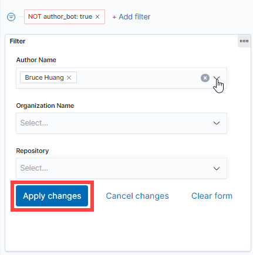

# Filtering Data

INSIGHTS aggregates data and creates comprehensive dashboards from specific data sources. Dashboards include relevant visualizations that display analytic metrics and important data points. You can select and open a dashboard from drop-down lists corresponding to each data source.

A drop-down list is only available when a related data source is available.

**Follow these steps:**

1. From a project overview page, click a data source, for example Pull Requests / Changesets.

2. Select a **dashboard** from the drop-down list:  
The selected dashboard appears and shows relevant visualizations.

3. On a selected dashboard, navigate to the **Filter** visualization, select values from the drop-down lists, and click **Apply Changes** to filter the dashboard data.

* **Apply changes:** Filters the dashboard as per selected values
* **Cancel changes**: If there are filter values selected before, it shows the previously selected filter values in the respective drop-down fields. If there are no filter values selected before, it cancels the present values.
* **Clear from:** It clears all the filter values, and lets you add new values in the respective drop-down fields.

## Refine Your View 

* [Select Time Range](select-time-range.md)
* [Add and Manage Data Filters](add-and-manage-data-filters.md)
* [Use Visualization Options](use-visualization-options.md)
* [Change the Data Marker Color](change-the-data-marker-color.md)
* [Inspect the Data](inspect-the-data.md)

