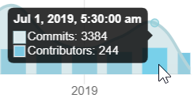
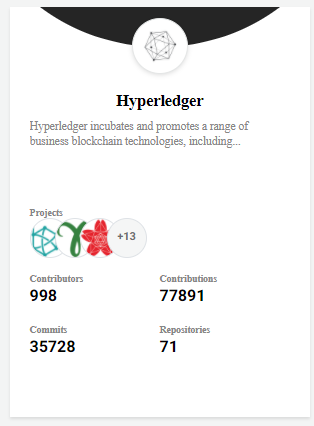

# Project or Foundation Overview

CommunityBridge Insights shows project and foundation cards, in alphabetical order, that show relevant data associated with the project or foundation.

**Follow these steps:**

1. Open [https://lfanalytics.io](https://lfanalytics.io/). The Projects page appears and lists the foundations and projects.
2. Navigate to a project or foundation card:
   * [Project Overview](project-or-foundation-overview.md#project-overview)
   * [Foundation Overview](project-or-foundation-overview.md#foundation-overview)
3. Click a standalone project or a project from foundation level. Dashboards appear based on what data is available for a project.
4. By default, [Summary](viewing-dashboards/summary.md) dashboard appears. Go to each dashboard. These dashboards are collection of charts and graphs that show you the metrics. The overview dashboards let you monitor many metrics at once, so you can check the health of your projects and see how the contribution is. For overview of individual data sources, see [Viewing Dashboards](viewing-dashboards/).
5. Use optional actions:
   * [Select Time Range](filtering-data/select-time-range.md)
   * Eliminate data by clicking the corresponding legend **caption** \(in this example **Contributors\)**. Click the **caption** again to include the data.  
   * Mouse over a color in a chart or graph to see details about the item. 

### Project Overview

A project is a standalone project maintained by Linux Foundation. Following is an example of a standalone project that shows an overview of project related data on the project card.

Each project card shows the following information:

* Project name identifies the project by name.
* Description briefly describes the project. When a project description shows only an excerpt, click the **excerpt** to see the entire description.
* **Contributors** shows the total number of contributors to the project.
* **Lines Changed** shows the total number of lines of codes that are changed in the project. It includes lines of code added, modified, and deleted.
* **Commits** shows the total number of commits to the project.
* **Repositories** shows the total number of repositories created for the project.
* **Data Sources** shows the logos of different data sources, such as  for GitHub and/or Gerrit,  for Jira, or  for Slack, and so on.

### Foundation Overview

A foundation is a group of individual standalone projects. Following is an example of a foundation that shows an overview of foundation related data on the card. Click the foundation to see number of standalone projects that come under Hyperledger foundation.

Each foundation card shows the following information:

* Foundation name identifies the foundation by name.
* Description briefly describes the project. When a project description shows only an excerpt, click the **excerpt** to see the entire description.
* **Projects** shows the logos of projects that come under a foundation.
* **Contributors** shows the total number of contributors to the project.
* **Lines Changed** shows the total number of lines of codes that are changed in the project. It includes lines of code added, modified, and deleted.
* **Commits** shows the total number of commits to the project.
* **Repositories** shows the total number of repositories created for the project.

