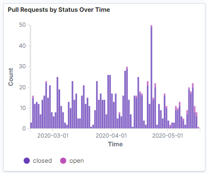

# Analyze GitHub Pull Requests


Roles: Developers, Community Managers

Where: GitHub Pull Requests dashboard is available from the **Source Control** drop-down list.


INSIGHTS lets you look at the pull request contributions to the project and answer questions such as:

* Who contributes to the community by submitting pull requests?
* How responsive is the project to changes?
* Who does the bulk of the work?
* Which organizations submit pull requests for the project?

**Follow these steps:**

1. Click a **project name** of interest that shows the GitHub logounder data sources.
2. From the **Source Control** drop-down list, select **GitHub** &gt; **Pull Requests**.

   A dashboard shows information about pull requests for a project and organization, and information about who submitted the pull request and when. For details, see [Source Control &gt; GitHub &gt; Pull Requests](../view-dashboard-catalog-of-a-project/source-control/github.md#pull-requests).

3. Use the visualizations to understand the project activity and other aspects of the pull requests:

   As a developer, you can see how active a project is and the average duration that pull requests remain open. In **Pull Request by Status Over Time**, you note a recurring pattern of pull requests that remain open too long within a certain time frame. The length of time pull requests remain open can indicate how responsive and welcoming your project maintainers are to outside contributors. If a pull request sits for too long without response, potential contributors may go to other projects. In addition, pull request metrics depend on the size of the project. Small projects might keep the number of open pull requests at 10 or fewer. Keeping pull requests at this limit would be challenging for large projects that have lots of community input compared to the number of maintainers. Reviewing pull requests takes time so large projects tend to have longer open duration than small projects. This data helps you decide if this is a project in which you want to spend your time.

As a project maintainer, you can see the number of pull requests by submitters, organizations, and repositories. In **Organizations**, you look for the organization that is doing the bulk of the development effort.

