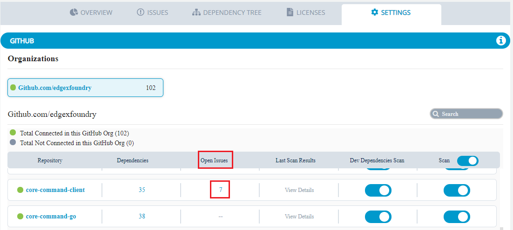
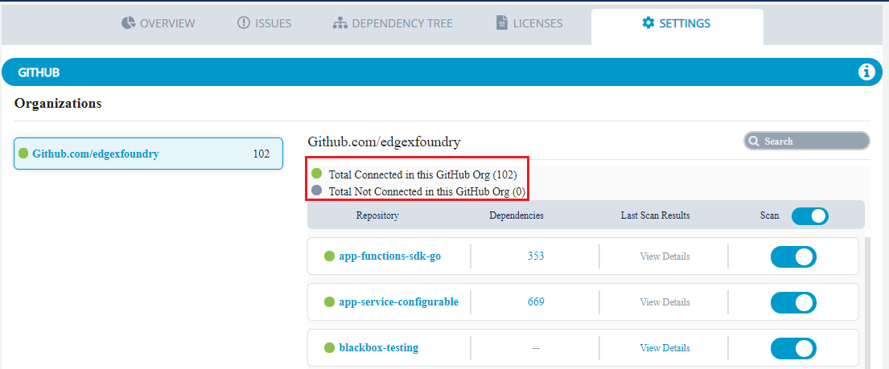

# Enable or Disable Scanning for a Repository

You can enable or disable scanning for a repository to refine scanning report of the project.

**To enable/disable a repository:**

1.Select **Settings** from the menu.  
All repositories of the project are listed in alphabetical order. 

2.Toggle the **Enable Scan** button to enable or disable a repository from scanning. 


You can also enable or disable scanning for all repositories by toggle of **Scan**. 


3.Under **Last** **Scan Results** tab, click **View details** to ****investigate a repository's scanned file.


The **View Details** link is enabled if there are errors during the repository's scan.


5.You can also see the open issues related to the repository under **Open Issues** tab.

6.You can also click on the **Total Connected/Not Connected** repositories that are connected to the Github org.  This will provide the details of the repositories that are connected or not connected.  

This provides the status of repositories within the GitHub Org, if the repositories are accessible or not.

