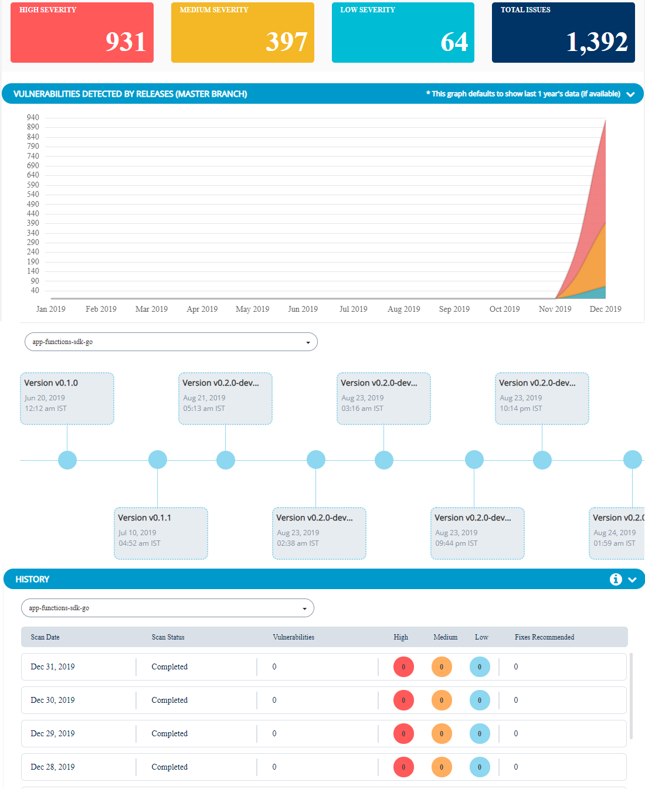
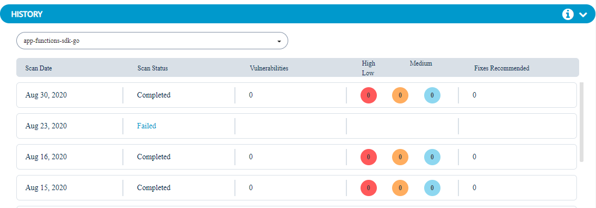

# Get a Vulnerability Status Overview

The Overview dashboard gives you an overall view of security issues and history of all the repositories in your project to make them prominent. CommunityBridge Security uses the Common Vulnerability Scoring System \(CVSS\) as a standard measurement for the severity of vulnerabilities. 

CVSS prioritizes vulnerability remediation activities and calculates the severity of vulnerabilities discovered in all your project repositories. The National Vulnerability Database \(NVD\) provides CVSS scores for almost all known vulnerabilities. Vulnerabilities are classified into HIGH/MEDIUM/LOW severity for easy prioritization.

**Do these steps:**

1.[Sign In](../../sso/sign-in/) to [CommunityBridge Vulnerability Detection](open-communitybridge-vulnerability-detection.md#projects-applied-to-communitybridge-vulnerability-detection).  
                                     Or  
    [Sign In](../../sso/sign-in/) to[ CommunityBridge Funding](open-communitybridge-vulnerability-detection.md#projects-applied-to-communitybridge-funding) if you have added your project to CommunityBridge Funding.

**Overview** shows number of vulnerabilities according to their severity level, it also shows number of fixable vulnerabilities. 

**Dependency Issues Over Time** shows a timeline of when security issues occurred and how many issues occurred at a certain time. Lines and icons in the timeline are colored to represent the threat levels.

Use this information to prioritize your investigation and remediation. To prioritize vulnerabilities, you might target one high-threat issue first. Additionally, it is important to focus on threats detected multiple times in the scanned code. Resolving one of these issues can make a marked difference in the security of the overall codebase.

## History 

**Security History** shows the date of the vulnerability scan, the scan status, number  of vulnerabilities,  the threat level is indicated as HIGH, MEDIUM, or LOW and the fixed recommended. 

## Version Tree

Version tree provides a version graph that provides the version details for a particular repository. As and when the changes are updated for the repository, an new version of the repository is created. This version tree provides details such as version number, updated date and time. 

