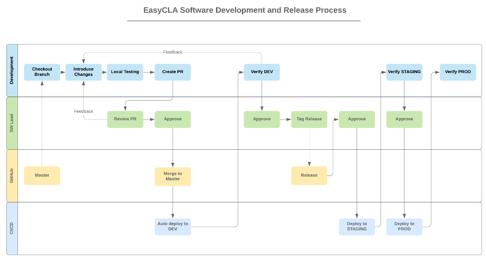

# EasyCLA

​[​](https://circleci.com/gh/communitybridge/easycla)EasyCLA streamlines the management and execution of Contributor License Agreements \(CLAs\), to help projects ensure that contributions are made in accordance with project policies. It is the only CLA management tool to correctly support both individual and corporate CLA workflows in an automated fashion.

## Quick Help 

For information about how to get started with contributing to a project that uses EasyCLA, please see [Getting Started](getting-started/) and our [FAQs page](https://github.com/communitybridge/docs/tree/f3a4dfdd6f9845ac96d41cd1b8878b1e12f70c92/easycla/getting-started/easycla-faqs/README.md).

For support questions, please see our [Troubleshooting page](getting-started/easycla-troubleshooting/) or [file a support ticket](https://docs.linuxfoundation.org/lfx/v/v2/easycla/getting-started/easycla-troubleshooting).

## EasyCLA Development

### Third-party Services 

​Besides integration with the LFX platform and its underlying services, EasyCLA uses the following third party services:

* ​[Docusign](https://www.docusign.com/) for the CLA agreement e-sign flow
* ​[Docraptor](https://docraptor.com/) for converting CLA templates from HTML to PDF

### EasyCLA Backend 

The EasyCLA tool has two backend components.

The majority of the backend APIs are implemented in Python, and can be found in the [`cla-backend`](https://github.com/communitybridge/easycla/tree/master/cla-backend) directory.

Recent backend development was implemented in Golang, and can be found in the [`cla-backend-go`](https://github.com/communitybridge/easycla/tree/master/cla-backend-go) directory. In particular, this backend contains APIs powering Automated Templates, GitHub Approved List of contributors, and Duplicate Company handling in the Corporate Console.

### EasyCLA Frontend 

The EasyCLA frontend consists of three independent Single Page Applications \(SPAs\) built with the [Ionic](https://ionicframework.com/) framework:

* [EasyCLA Project Console](https://projectadmin.lfx.linuxfoundation.org/) for a project's director or manager \(typically an LF staff member\) to oversee the project's CLA setup. It is sometimes referred as the LFX Project Control Center in this documentation.
* [EasyCLA Contributor Console](https://github.com/communitybridge/easycla-contributor-console) for a contributor to a project to sign an Individual CLA \(ICLA\), or to kick off the corporate CLA \(CCLA\) signature process.
* [EasyCLA Corporate Console](https://member.lfx.linuxfoundation.org/) for a company's CLA Manager to coordinate the corporate CLA signature process, and then to manage their company's authorized contributors.

### EasyCLA Architecture 

The following diagram illustrates EasyCLA's architecture:

### EasyCLA Release Process 

The following diagram illustrates the EasyCLA release process:

## License 

This project’s source code is licensed under the MIT License. A copy of the license is available in [LICENSE](https://github.com/communitybridge/easycla/blob/main/LICENSE).

The project includes source code from `keycloak`, which is licensed under the Apache License, version 2.0 \(Apache-2.0\), a copy of which is available in [LICENSE-keycloak](https://github.com/communitybridge/easycla/blob/main/LICENSE-keycloak).

This project’s documentation is licensed under the Creative Commons Attribution 4.0 International License \(CC-BY-4.0\). A copy of the license is available in [LICENSE-docs](https://github.com/communitybridge/easycla/blob/main/LICENSE-docs).

