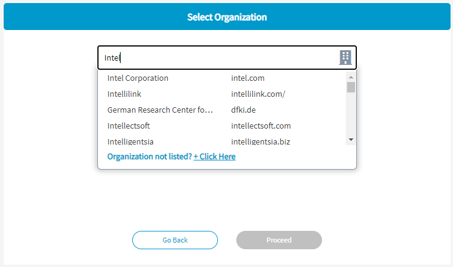
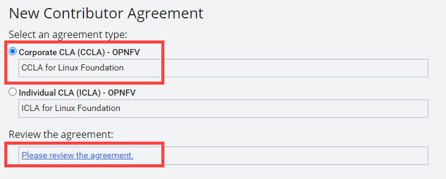
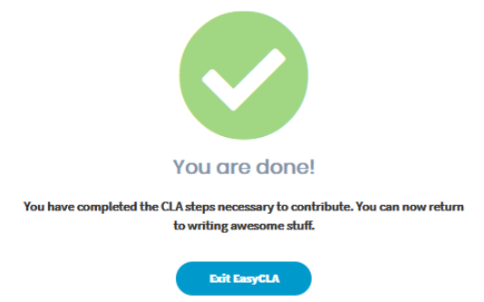
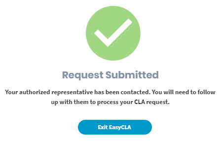

# Corporate Contributor

As a corporate \(employee\) contributor, you are contributing code on company's behalf. When Corporate CLA is signed for the project, you confirm your association with the company during your first pull request or change submit. Your subsequent contributions will neither require association confirmations nor will they be gated by CLA check.

* [GitHub](corporate-contributor.md#github)
* [Gerrit](corporate-contributor.md#gerrit)

## GitHub

1. In GitHub, go to the repository that is linked to the project for your organization.

2. Make a change and send a pull request.

3. EasyCLA checks the CLA status of all committers involved in that pull request.


1. EasyCLA marks a cross or a tick beside contributor names involved in that pull request based on their CLA status.
2. A cross next to your contributor name means the CLA check failed.


4. Click  or **Please click here to be authorized**.  
**Note:** The Authorize Linux Foundation: EasyCLA dialog appears.

5. Click **Authorize LF-Engineering**. \(Subsequent contributions will not require authorization.\)

**Result:** The CLA Contributor Console appears in a new tab.

​  ​

6. Click **Proceed as a Corporate Contributor**.   
**Note:** To contribute to this project, you must be authorized under a signed Contributor License Agreement.

7. On **Select Organization** window, type organization name or [signing entity name](../glossary.md#signing-entity-name) of the organization in the field, select the [signing entity name](../glossary.md#signing-entity-name) for the organization from the drop-down list, and click **Proceed**.


**Note:** 

* If your company or the signing entity is not in the list, you can add the company and/or its signing entity name as described in [If Company is not in the list](corporate-contributor.md#if-the-select-company-dialog-appears-1) or [if Signing Entity Name is not in the List](corporate-contributor.md#if-signing-entity-name-is-not-in-the-list).
* **Setup Required** window appears if the company has not completed the CLA set-up. Click the link to submit a ticket, and click Exit CLA.


8. Continue:

* [If you are not added to the approved list](corporate-contributor.md#if-you-are-not-added-to-the-approved-list)
* [If you are added to the approved list](corporate-contributor.md#if-you-are-added-to-the-approved-list)
* [If you are asked to sign ICLA](corporate-contributor.md#if-you-are-asked-to-sign-icla)
* [If Company has not signed CLA](corporate-contributor.md#if-the-select-company-dialog-appears)
* [If Company is not in the List](corporate-contributor.md#if-the-select-company-dialog-appears-1)
* [If Signing Entity Name is not in the List](corporate-contributor.md#if-signing-entity-name-is-not-in-the-list)

## Gerrit

1. In Gerrit, clone a repository under the Gerrit instance into your local machine.

2. Make a change and push the code to your Gerrit repository.

3. A warning link that you need to sign a CLA appears:

4. Navigate to the Gerrit instance of your project. For example, if you are contributing to OPNFV project, navigate to [https://gerrit.opnfv.org](https://gerrit.opnfv.org/)​

5. Sign in using your LF [Single Sign-On \(SSO\)](https://docs.linuxfoundation.org/lfx/sso/create-an-account) account.

6. Navigate to **Settings**— the gear icon on the upper right corner, and click **Agreements** from the menu on the left:

​​    ​​

7. Click **New Contributor Agreement**.

8. Click **Corporate CLA** , and then click **Please review the agreement** link.

9. Click **Proceed To Corporate Authorization**.

10. You are redirected to Corporate Contributor Console. Sign in if prompted.

11. Continue:

* [If you are not added to the approved list](corporate-contributor.md#if-you-are-not-added-to-the-approved-list)
* [If you are added to the approved list](corporate-contributor.md#if-you-are-added-to-the-approved-list)
* [If you are asked to sign ICLA](corporate-contributor.md#if-you-are-asked-to-sign-icla)
* [If Company has not signed CLA](corporate-contributor.md#if-the-select-company-dialog-appears)
* [If Company is not in the List](corporate-contributor.md#if-the-select-company-dialog-appears-1)
* [If Signing Entity Name is not in the List](corporate-contributor.md#if-signing-entity-name-is-not-in-the-list)

## If you are not added to the approved list

If your company has signed CLA, but you are not added to the approved list, **Request Authorization to Contribute** window appears that shows the CLA manager\(s\) for your company.

1. Select CLA manager\(s\) from the drop-down list whom you want to request for authorizing you to contribute.  
**Note:** Clicking **Exit EasyCLA** cancels the CLA signing process.

2. Click **Request Authorization**.  
A dialog appears and informs you: Request Submitted ​

3. Click **Exit EasyCLA**.  
_****_The CLA  manager adds you to the approved list.


You will receive an email notification if the CLA manager approves or rejects your request to be approved as a corporate contributor for the company.


## If you are added to the approved list

1. Based on the CLA configuration, you will be asked to [sign individual CLA](corporate-contributor.md#if-you-are-asked-to-sign-icla) if the CLA requires corporate contributors to sign individual CLA.

2. An acknowledgement window appears informing you that you have completed the contribution acknowledgement.  
  

3. Click **Exit EasyCLA**.

Navigate to the GitHub or Gerrit. Wait a few seconds for the CLA status to update or refresh the page, and merge PR or submit change.

## If you are asked to sign ICLA

1. If you are added to the approved list, but your CLA requires you to sign Individual CLA \(ICLA\),  the following screen appears:  
  

2. Click **Proceed**.

3. On **CLA Ready For Signature** window, click **SIGN CLA**.  
  

4. Follow the instructions in the DocuSign document, sign it, and click **FINISH**.


* You receive an email from The Linux Foundation, informing you that you have signed the CLA. 
* You can download the PDF document by clicking the link from the email. You will be redirected to Linux Foundation's website. If the download doesn't start automatically, click **Proceed to Download**.  


Navigate to the GitHub or Gerrit. Wait a few seconds for the CLA status to update or refresh the page, and merge PR or submit change.

## If Company has not signed CLA 

If your company has not signed a CLA, **No Signed CLA Found** window appears.

1. Click an answer: **Are you authorized to be a CLA Manager for your organization?**

* [Yes](corporate-contributor.md#yes-if-you-are-authorized)
* [No](corporate-contributor.md#no-if-you-are-not-authorized)

### **Yes \(If you  are authorized\)**

1. A **Configuring CLA Manager Settings** window appears. 

2. After the configuration settings is completed, click **Proceed**.

3.  Click **Proceed** on the window that appears. Ensure that you disable pop-up blocker if you have enabled any as shown in the note.


**Important:** If you don't have a username \(LF SSO Account\) associated with Linux Foundation, you will be redirected to Linux Foundation page to create a username.


4. You will be redirected to corporate console on a new tab to [sign a CLA](../corporate-cla-manager-designee-or-initial-cla-manager/sign-corporate-cla-for-a-company.md).

After you successfully sign a CCLA, navigate to the GitHub or Gerrit. Wait a few seconds for the CLA status to update or refresh the page, and merge PR or submit change.

### **No \(If you are not authorized\)**

1. An **Identify CLA Manager** form appears.  
  

2. Complete the form, and click **Submit Request**, ****Or if you don't know email address of CLA Manager of your company, click **Contact Company Admin**.  
**Result:** A window appears confirming that request is submitted. You must follow up with the individual for you to be added to the approved list.

3. Click **Exit EasyCLA**.  
You can contribute after the authorized representative signs a corporate CLA, and adds you to the approved list. 


You will receive an email after you are added to the approved list. After you are added, you [acknowledge the company contribution](corporate-contributor.md#if-you-are-added-to-the-approved-list) and/or [sign ICLA](corporate-contributor.md#if-you-are-asked-to-sign-icla) if the CLA is configured for you to sign ICLA before you can contribute to the project.


## If Company is not in the List 

1. Click **+Click Here** next to **Organization not listed?**

2. ****Provide organization website URL, organization name, and signing entity name in the respective fields.

4. Click **Next**.

3. A window appears confirming that the organization is successfully added.  
**Note:**  if the company is already added to the list, **Company Already Exists** window appears and directs you to re-enter the company name in the Search field. You can search again to find the company.

4. Click **Proceed** to [sign a corporate CLA](../corporate-cla-manager-designee-or-initial-cla-manager/sign-corporate-cla-for-a-company.md).

## If Signing Entity Name for an Existing Company is not in the List

1. Click **+Click Here** next to **Organization not listed?**

2. Provide organization website URL, and select the organization name from the list.

3. Provide signing entity name in the **Signing Entity Name** field, and click **Next**.

4. If company has signed CLA, clicking **Next** displays the CLA managers from the company. Select CLA managers whom you want to [request to authorize](corporate-contributor.md#if-you-are-not-added-to-the-approved-list) you to contribute.

5. If company has not signed CLA, proceed ****to [sign a corporate CLA](../corporate-cla-manager-designee-or-initial-cla-manager/sign-corporate-cla-for-a-company.md).

