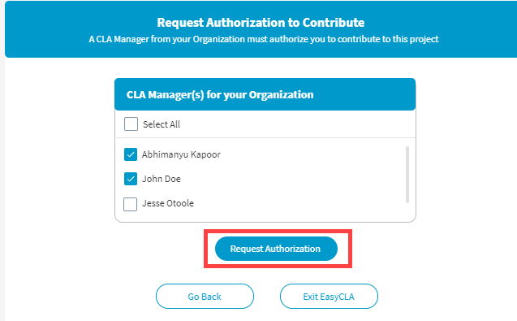
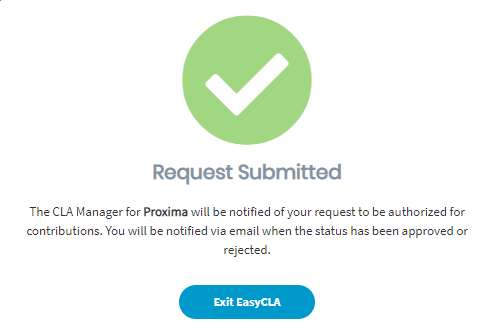
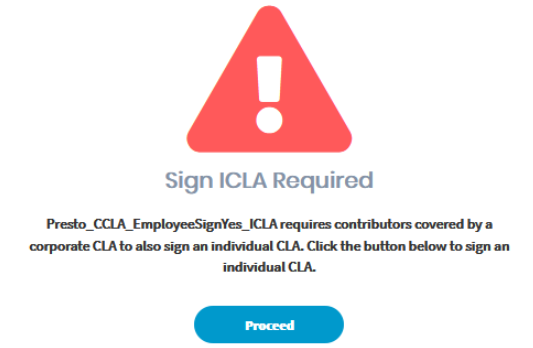
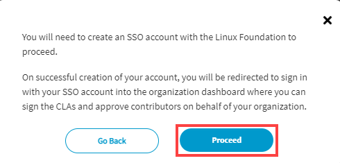
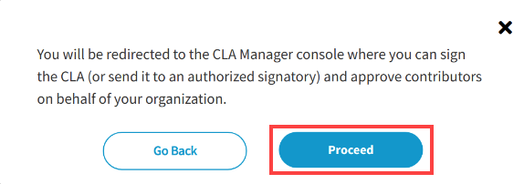
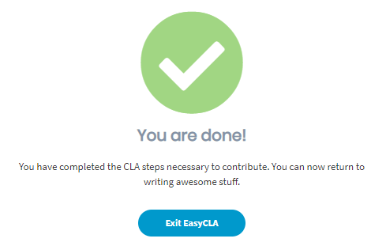

# Corporate Contributor

As a corporate \(employee\) contributor, you are contributing code on company's behalf. When Corporate CLA is signed for the project, you confirm your association with the company during your first pull request or change submit. Your subsequent contributions will neither require association confirmations nor will they be gated by CLA check.

* [GitHub](corporate-contributor.md#github)
* [Gerrit](corporate-contributor.md#gerrit)

## GitHub

1. In GitHub, go to the repository that is linked to your project.

2. Make a change and create a pull request.

3. EasyCLA checks the CLA status of all committers involved in that pull request.


1. EasyCLA marks a cross or a tick beside contributor names involved in that pull request based on their CLA status.
2. A cross next to your contributor name means the CLA check has failed.


4. Click  or **Please click here to be authorized**.

5. Click **Authorize LF-Engineering**. \(Subsequent contributions will not require authorization.\)

**Result:** The CLA Contributor Console appears in a new tab.

​  ​

6. Click **Proceed as a Corporate Contributor**.

7. On **Select Organization** window, type organization name in the field, select the organization from the drop-down list, and click **Proceed**.


**Note:**

* If your company is not in the list, you can add the company as described in [If Company is not in the list](corporate-contributor.md#if-the-select-company-dialog-appears-1).


8. You will need to complete one of the following workflows:

* [If you are not added to the approved list](corporate-contributor.md#if-you-are-not-added-to-the-approved-list)
* [If you are asked to sign ICLA](corporate-contributor.md#if-you-are-asked-to-sign-icla)
* [If Company has not signed CLA](corporate-contributor.md#if-the-select-company-dialog-appears)
* [If Company is not in the List](corporate-contributor.md#if-the-select-company-dialog-appears-1)

## Gerrit

1. In Gerrit, clone a repository under the Gerrit instance into your local machine.

2. Make a change and push the code to your Gerrit repository.

3. A warning link that you need to sign a CLA appears:

4. Navigate to the Gerrit instance of your project. For example, if you are contributing to OPNFV project, navigate to [https://gerrit.opnfv.org](https://gerrit.opnfv.org/)​

5. Sign in using your LF [Single Sign-On \(SSO\)](https://docs.linuxfoundation.org/lfx/sso/create-an-account) account.

6. Navigate to **Settings**— the gear icon on the upper right corner, and click **Agreements** from the menu on the left:

​​    ​​

7. Click **New Contributor Agreement**.

8. Click **Corporate CLA** , and then click **Please review the agreement** link.

9. Click **Proceed To Corporate Authorization**.

10. You are redirected to Corporate CLA Console. Sign in with LF login name if prompted.

11. You will need to complete one of the following workflows:

* [If you are not added to the approved list](corporate-contributor.md#if-you-are-not-added-to-the-approved-list)
* [If you are asked to sign ICLA](corporate-contributor.md#if-you-are-asked-to-sign-icla)
* [If Company has not signed CLA](corporate-contributor.md#if-the-select-company-dialog-appears)
* [If Company is not in the List](corporate-contributor.md#if-the-select-company-dialog-appears-1)

## If you are not added to the approved list

If your company has signed CLA, but you are not added to the approved list, **Request Authorization to Contribute** window appears that shows the CLA manager\(s\) for your company.

1. Select CLA manager\(s\) from the drop-down list whom you want to request to authorizing you.  
**Note:** Clicking **Exit EasyCLA** cancels the CLA signing process.

2. Click **Request Authorization**.  
  

3. Click **Exit EasyCLA**.


* **GitHub Contributors:** After the CLA manager adds you to the approved list, you must [acknowledge company contribution](corporate-contributor.md#acknowledge-company-contribution) or[ sign ICLA](corporate-contributor.md#if-you-are-asked-to-sign-icla) if your CLA requires you to sign individual CLA before you can contribute code under the signed CLA.
* **Gerrit Contributors:** After the CLA manager adds you to the approved list, or you sign corporate CLA and become CLA manager but you still see **No Contributor Agreement** error, then sign out from Gerrit, sign in again, and then [follow the procedure](corporate-contributor.md#gerrit) again to submit the change.


## If you are asked to sign ICLA

1. If you are added to the approved list, but your CLA requires you to sign Individual CLA \(ICLA\),  then the following screen appears:  
  

2. Click **Proceed**.

3. On **CLA Ready For Signature** window, click **SIGN CLA**.  
  

4. Follow the instructions in the DocuSign document, sign it, and click **FINISH**.  
**Note:** Ensure that the organization name is correct in the document before you sign.


* **GitHub Contributors:** Navigate to the GitHub page. Wait a few seconds for the CLA status to be updated or refresh the page.
* **Gerrit Contributors:** If ****you still see **No Contributor Agreement** error, then sign out from Gerrit, sign in again, and then [follow the procedure](corporate-contributor.md#gerrit) again to submit the change.


## If Company has not signed CLA 

If your company has not signed a CLA, **No Signed CLA Found** window appears.

1. Click an answer: **Are you authorized to be a CLA Manager for your organization?**

* [Yes](corporate-contributor.md#yes-if-you-are-authorized) — You become the initial CLA manager after you sign CLA.
* [No](corporate-contributor.md#no-if-you-are-not-authorized) — Send request to the authorized person to sign CLA.

### **Yes \(If you  are authorized\)**

1. Click **Proceed** on the window that appears.


**Note:** If you don't have a username \(LF SSO Account\) associated with Linux Foundation, you will be redirected to The Linux Foundation page to create a username.


2.  Click **Proceed** again.

3. You will be redirected to corporate console to [sign a CLA](../corporate-cla-manager-designee-or-initial-cla-manager/sign-corporate-cla-for-a-company.md).


**Important:** After you sign the CLA, and want to contribute to the project, you must [add yourself to the approved list](../corporate-cla-managers/approve-and-manage-contributors.md#add-contributor-s), and [complete company acknowledgement](corporate-contributor.md#acknowledge-company-contribution) before you can contribute.


### **No \(If you are not authorized\)**

1. An **Identify CLA Manager** window appears.  
  

2. Complete the form, and click **Submit Request**, ****Or if you don't know email address of the CLA Manager of your company, click **Contact Company Admin**.

3. Click **Exit EasyCLA**.  
You can contribute after the authorized representative signs a corporate CLA, and adds you to the approved list.


* **GitHub Contributors:** You will receive an email after you are added to the approved list. After you are added, you must [acknowledge the company contribution](corporate-contributor.md#acknowledge-company-contribution) and/or [sign ICLA](corporate-contributor.md#if-you-are-asked-to-sign-icla) if the CLA is configured for you to sign ICLA before you can contribute to the project.
* **Gerrit Contributors**: After the CLA manager adds you the approved list, if you still see **No Contributor Agreement** error, then sign out from Gerrit, sign in again, and then [follow the procedure](corporate-contributor.md#gerrit) again to submit the change.


## If Company is not in the List 

1. Click **+Click Here** next to **Organization not listed?**

2. ****Provide organization website URL, and organization name in the respective fields.  
**Note:** If the website URL is already associated with an organization, the organization name appears in the **Organization Name** field, and you cannot edit the name.

3. Click **Next**.

4. Click an answer: **Are you authorized to be a CLA Manager for your organization?**

* **Yes:** Follow the procedure, and click **Proceed** to [sign corporate CLA](../corporate-cla-manager-designee-or-initial-cla-manager/sign-corporate-cla-for-a-company.md).
* **No:** Provide name and email address of the person whom you want to authorize as a CLA manager for your company, and click **Submit Request**.

## Acknowledge Company Contribution

After the CLA manager adds you to the approved list, you must acknowledge company contribution before you can contribute code under the signed CLA.

1. Navigate to the GitHub PR page.

2. Click **Not Covered**, and follow the procedure.

3. On **Select Organization** window, select the company, and click **Proceed**.

A window appears confirming your association with the company. Click Exit EasyCLA, and you will be redirected to GitHub page for the CLA status to be updated.  
 

