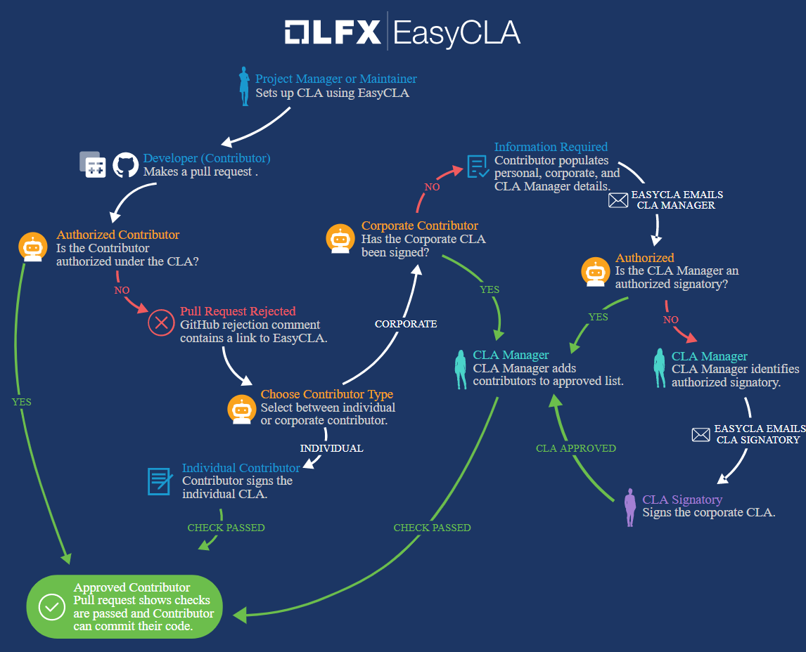

# Getting Started

## What is LFX EasyCLA? 

_LFX EasyCLA_ helps maintainers of open source projects streamline their workflows and reduce the hassle of managing Contributor License Agreements \(CLAs\) and authorizing contributors. By automating many of the manual processes, this open source solution hosted by the Linux Foundation reduces delays for developers to get authorized under a CLA.

## What is a CLA? 

A _Contributor License Agreement_ \(CLA\) defines the terms under which intellectual property is contributed to a company or project. Typically, the intellectual property is software under an open source license. EasyCLA helps to ensure that contributions are not pulled into a project unless a CLA covering the contributor has been signed. CLAs typically fall into one of two categories:

* **Corporate Contributor License Agreement**

  If the company \(employer\) owns the contribution, a CCLA signatory signs a Corporate CLA. The Corporate CLA legally binds the corporation, so the agreement must be signed by a person with authority to enter into legal contracts on behalf of the corporation. A Corporate CLA may not remove the need for every employee \(developer\) to sign their own Individual CLA -- which separately covers contributions owned by the individual contributor -- if the project requires this.

* **Individual Contributor License Agreement**

  If as an individual you own the contribution, you sign the Individual CLA. A signed Individual CLA may be required before an individual's contribution can be merged into the project repository.

## How Does it Work? 

The following high-level diagram shows the different flows and roles that EasyCLA supports.

## What Role are You? 

How you interact with EasyCLA depends on your role. EasyCLA supports the following roles in its workflow:

* [Project Manager](./#project-manager)
* [Contributor](./#contributor)
* [Corporate CLA Manager](./#corporate-cla-manager)
* [Corporate CLA Signatory](./#corporate-cla-signatory)

### Project Manager 

You are a _project manager_ if you are the project maintainer who has responsibilities such as managing a project’s GitHub organization or Gerrit instance, members, repositories, and CLAs. You have access to specific projects within the EasyCLA project console, also referred as Project Control Center.

With EasyCLA, you do the following CLA set-up tasks:

1. [Install the EasyCLA Application](../project-managers/install-the-easycla-application.md).
2. [Add a CLA Group](../project-managers/add-a-cla-group.md).
3. [Add Contributor License Agreements](../project-managers/add-contributor-license-agreements.md).
4. [Add GitHub repositories](../project-managers/add-github-repositories-to-cla-monitoring-or-remove-them-from-cla-monitoring.md) or [Gerrit instances](../project-managers/add-gerrit-instances-to-cla-monitoring-or-delete-them-from-cla-monitoring.md) to enforce CLA monitoring.

At any time, you can change the settings to manage your project CLA monitoring, and do other management tasks:

* [View Current and Previous CLA PDFs](../project-managers/view-current-and-previous-cla-pdfs.md)
* [Manage CLA Group Details](../project-managers/manage-cla-group-details.md)

### Contributor 

You are a _contributor_ \(developer\) if you contribute code to GitHub or Gerrit projects. With EasyCLA, you will follow different workflows depending on whether the project is hosted on GitHub or Gerrit, and whether you contribute on behalf of a company or yourself as an individual:

* **Individual Contributor \(GitHub\):** [Sign a CLA as an Individual Contributor and contribute to GitHub project](../contributors/individual-contributor.md#github).
* **Individual Contributor \(Gerrit\):** [Contribute  to Gerrit project](../contributors/individual-contributor.md#gerrit)
* **Corporate** **Contributor \(GitHub\):** [Contribute to GitHub project](../contributors/corporate-contributor.md#github)
* **Corporate** **Contributor \(Gerrit\):** [Contribute to Gerrit Project](../contributors/corporate-contributor.md#gerrit)

### Corporate CLA Manager 

You are a _Corporate CLA manager_ \(CCLA manager\) if you are the person authorized to manage the list of approved contributors under your company’s Corporate CLA. There can be one or more CLA managers for a company. With this responsibility, you use EasyCLA to:

* [Add companies to a project](../cla-manager/add-a-company-to-a-project.md)
* [Approve Contributors](../cla-manager/approve-contributors.md)
* [Add or Delete CLA Managers](../cla-manager/add-or-delete-cla-managers.md)

### Corporate CLA Signatory 

You are a _Corporate CLA signatory_ \(CCLA signatory\) if you are authorized to sign contracts, such as the project’s CLA, on behalf of the company. With EasyCLA, you can:

* [Review and sign a Corporate CLA by request](../cla-signatories/review-and-sign-a-corporate-cla-by-request.md).

