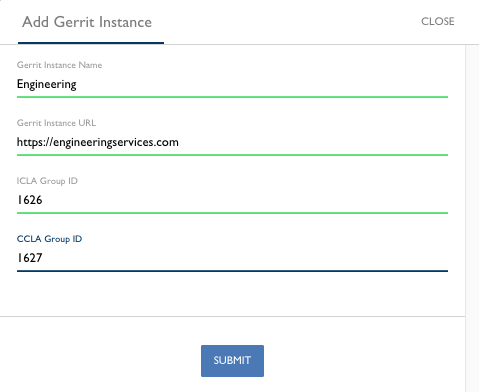

# Add Gerrit Instances to CLA Monitoring or Delete Them From CLA Monitoring

As a project manager, you use the CLA Management Console to:

* Add one or more Gerrit instances to CLA monitoring
* Integrate the Gerrit repositories so you can monitor all the code submissions that contributors make
* Delete Gerrit instances from CLA monitoring as required

If you already added a Gerrit instance during the CLA onboarding process, skip this procedure unless you want to add more Gerrit instances.

**To add or remove Gerrit Instances:**

1\. [Sign in](sign-in-to-the-easycla-management-console.md) to the CLA management console.

2\. Click a **project** of interest

3\. Click **ADD GERRIT INSTANCE**\
****The Add Gerritt Instance form appears.

4\. Complete the form fields, and click **SUBMIT**.\
**Gerrit Instance Name** - Name of the Gerrit Instance\
**Gerrit Instance URL** - URL of the Gerrit Instance\
**ICLA Group ID** - An existing LDAP Group ID for Individual CLAs\
**CCLA Group ID** - An existing LDAP Group ID for Corporate CLAs

**Notes:**

1. Contact the Linux Foundation IT if you do not know the LDAP Group IDs.
2. One or both LDAP groups must exist for you to be able to create a Gerrit instance. If a group does not exist, an error message appears and you are prevented from creating a Gerrit instance.

The CLA Management Console lists the instance under Gerrit Instances.​​\
The CLA Management Console presents a CLA block of code:\
\
`[contributor-agreement "{ICLA-Name} “]`\
`description = ICLA for Linux Foundation`\
`agreementUrl = {URL }`\
`accepted = group {Group-Name}`\
`[contributor-agreement "{CCLA-Name} “]`\
`description = CCLA for Linux Foundation`\
`agreementUrl = {URL }`\
`accepted = group {Group-Name}`

5\. Copy the block. As the Gerrit instance administrator, you will modify CLA configurations for the following files under the Gerrit instance’s All-Projects repository. If you are not the administrator, contact the Gerrit instance administrator to include the following files under the Gerrit instance’s All-Projects repository. Projects are organized hierarchically as a tree with the All-Projects project as root from which all projects inherit.

You can get and set the configuration variables by using the git config command with the -l option (this option provides the current configuration), or if you are using the Gerrit web interface, go to Projects and click List. Select your project and click **Edit Config**.

**project.config** - Add the contributor license agreement block to this project configuration file. This is the project configuration file across all repositories of the Gerrit instance. At the end of the file, replace the variables with your project CLA values and then save the file:

`[contributor-agreement "{CLA-Name} “]`\
`description = CLA for Linux Foundation`\
`agreementUrl = {URL }`\
`accepted = group {Group-Name}`

* _**CLA-Name**_ can be a name of your choosing. The name must include the double quotes.
* _**URL**_** **refers to the URL to the CLA Contributor Console.
* _**Group-Name**_ should be an existing Group Name, under the Group section of the Gerrit instance. This name refers to the LDAP Group that the user will be added to.
* **groups** - If the Group-Name value that you specified in the project.config file does not exist in this file, add it to this file, and then save the file.
* Provide these files and Gerrit configuration to the Linux Foundation Release Engineering team to finish configuration. \
  The CLA Management Console shows the repositories that the CLA application will monitor.

6\. To delete an instance from monitoring, click **DELETE** next to the instance that you want to delete. A confirmation dialog appears. Click **DELETE**.
