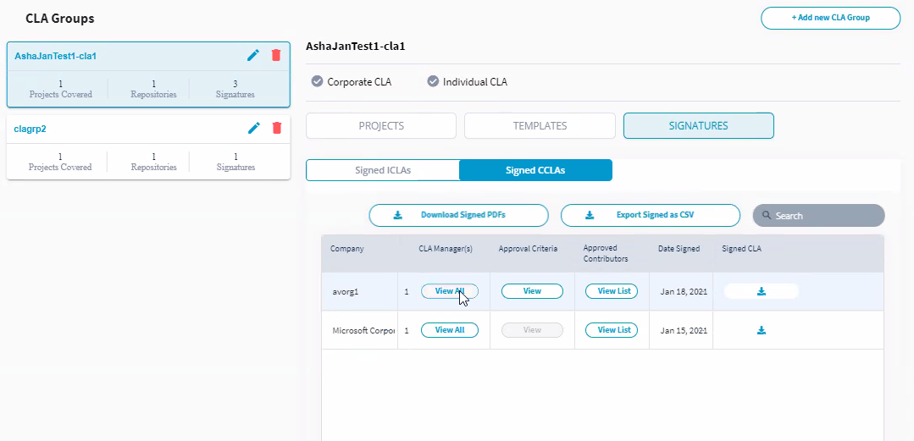

# View and Manage CLA Group Details

A Project Manager can view CLA group details and can update a CLA group details by updating or deleting a CLA group name, updating a CLA template, and invalidating a contributor's signature.

1. Sign in to the [Project Control Center](https://projectadmin.lfx.linuxfoundation.org/).
2. Click a **project name** of interest.
3. Scroll down to **Tools Status** section, and click  **EasyCLA**. The EasyCLA Overview page appears.

The Overview page displays CLA groups that have been added to the project, [details for each CLA group](view-and-manage-cla-group-details.md#cla-group-details), and [activity log](view-and-manage-cla-group-details.md#activity-log) table. A CLA group defines a CCLA and/or ICLA that contributors must sign.

#### CLA Group Details:

1. **Name** of the CLA group, and whether the CLA Group includes a CCLA and/or an ICLA with a tick mark beside each CLA type.

1. **Projects Covered** shows the number of projects that are covered under the CLA group.
2. **Repositories** shows the total number of repositories of the added projects that are enrolled for CLA monitoring. You must [enforce EasyCLA](add-and-manage-git-organizations-and-repositories/enforce-or-remove-cla-monitoring.md) for one or more Git repositories for them to be counted.
3. **Signatures** shows the number of individuals who have signed CLA within that CLA group, and whose signature status is in active state. This includes both ICLA and/or CCLA based on the CLA group configuration. To know more about 
4. Clickto edit the title and description of the CLA group.
5. Clickto create a support ticket requesting to delete the CLA group.

2. Under the **PROJECTS** tab, expand the project group to view projects that are enrolled for the CLA group. Inactive selected check boxes indicate that the project has already been added to another CLA group. Click **Manage** to [add and manage Git organizations and repositories](add-and-manage-git-organizations-and-repositories/).

3. Navigate to **TEMPLATES** tab to view and download the ICLA and/or CCLA templates. You can [update the templates](update-templates.md) incase the email address mentioned in the template is not correct or you want to change.

4. Navigate to **SIGNATURES** tab to view signed ICLAs and CCLAs.

* **Signed ICLAs** lists details of individuals who have signed an ICLA, such as name, LF Login name \(LF ID\), GitHub ID, email address, status of their signature \(Active, Disabled, Invalidated\), and Invalidate CTA under Actions column \(enabled only for Active statuses\). Following are the different signature statuses:
  * **Active:** The contributor has completed the CLA signing process.
  * **Incomplete:** The contributor has not completed the CLA signing process.
  * **Disabled:** Either the project manager has invalidated the signature of the contributor or CLA manager has removed the contributor's approved criteria from the approved criteria list on corporate CLA console.
* **Signed CCLAs** lists the details of companies that have signed a CCLA. It lists the company name, CLA Managers, approved contributors, approval criteria for the approved contributors, and the signed CCLA document along with the date.

#### **ACTIVITY LOG:** 

It shows the recent CLA activities for the projects within the CLA group, such as activity description, name of the person who did the activity, date and time of the activity, the corresponding company name where applicable, and the applicable project.

