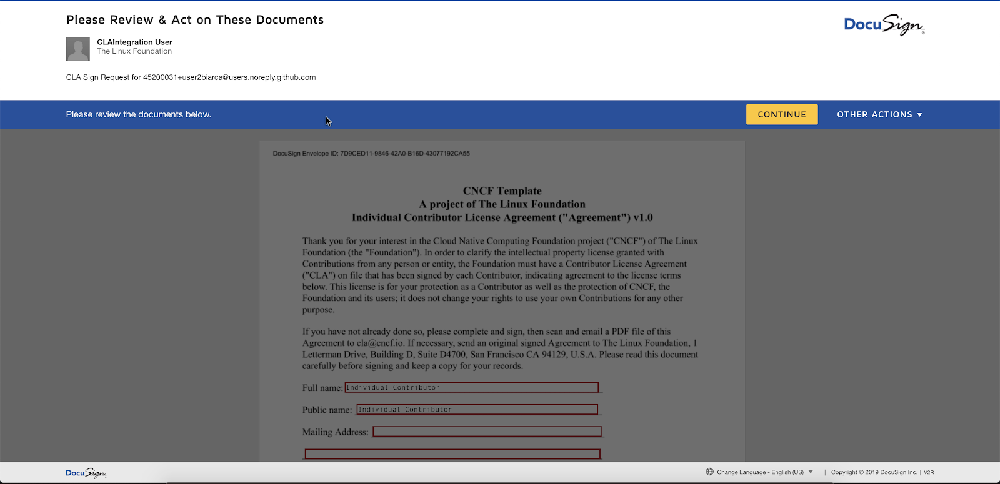

# Individual Contributor

As an individual contributor, you are contributing code on your own behalf (not on behalf of an employer). You create a pull request in GitHub or submit changed code in Gerrit to inform reviewers about the changes. During the process, your CLA is verified, and you must sign a CLA if you have not already signed, before you can contribute to GitHub or Gerrit.

* [GitHub](individual-contributor.md#github)
* [Gerrit](individual-contributor.md#gerrit)

## GitHub

1\. Navigate to the GitHub repository that is linked to the project for your organization.

2\. Make a change and send a pull request.


* EasyCLA checks your CLA status. It marks a cross or a tick beside your name based on your CLA status.
* A cross next to your contributor name means the CLA check failed.


3\. Click  or **Please click here to be authorized**.

4\. Click **Authorize LF-Engineering**. (Subsequent contributions will not require authorization.)

​  

The CLA Contributor Console appears and shows the CLA group for your project. The CLA types display:

5\. Click **Individual** and then click **OPEN CLA**.

.png>)

DocuSign presents the agreement that you must sign. The ICLA is not tied to any employer you may have, so enter your @personal address in the E-Mail field.

6\. Follow the instructions in the DocuSign document, sign it, and click **FINISH**.


* You receive an email from The Linux Foundation, informing you that you have signed the CLA. 
* You can download the PDF document by clicking the link form the email. You will be redirected to Linux Foundation's website. If the download doesn't start automatically, click **Proceed to Download**.\
   


You are redirected to GitHub. Wait a few seconds for the CLA status to update. A tick appears next to your branch.

7\. Click **Merge pull request** and confirm the merge.

## Gerrit

1\. In Gerrit, clone a repository under the Gerrit instance into your local machine.

2\. Make a change and push the code to your Gerrit repository.

3\. A warning link that you need to sign a CLA appears:

4\. Navigate to the Gerrit instance of your project. For example, if you are contributing to OPNFV project, navigate to [https://gerrit.opnfv.org](https://gerrit.opnfv.org)​

5\. Sign in using your [Single Sign-On (SSO)](../../../sso/sign-in/) account.

6\. Navigate to **Settings**— the gear icon on the upper right corner, and click **Agreements** from the menu on the left:

​​    ​​

7\. Click **New Contributor Agreement**.

8\. Select **Individual CLA (ICLA)**, and click **Please review the agreement**.

9\. Sign in to EasyCLA if you are prompted.

10\. Click **OPEN CLA** on the dialog that appears:\
DocuSign presents the agreement that you must sign. The Individual CLA is not tied to any employer you may have, so enter your @personal address in the EMail field.

11\. Follow the instructions in the DocuSign document, sign it, and click **FINISH**.

You are redirected to Gerrit. Wait a few seconds for the CLA status to update.

