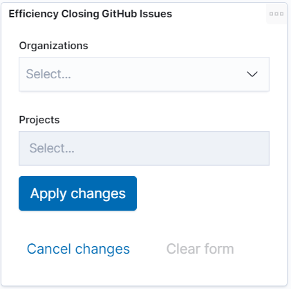
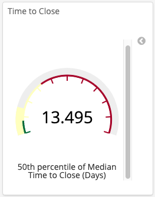
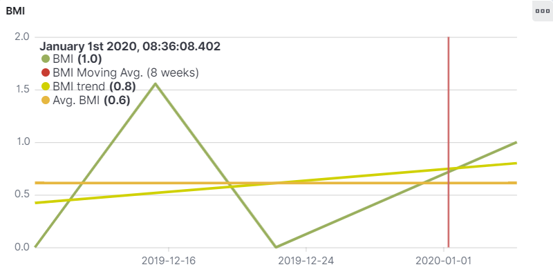
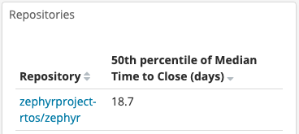

# Analyze Efficiency Closing GitHub Issues


Role: Developer, Project Manager, Community Manager

Where: GitHub issue dashboards are available from the **Issue Management** drop-down list.


Users who cannot submit a pull request, but encounter problems with code can submit their bugs and feature requests as issues. The number of issues, and how they are addressed, can indicate your projects’ levels of user adoption as well as how responsive maintainers are to user needs. This number depends on how issues are tracked. Consider that issues may remain open longer for a project that uses GitHub issues only for bugs rather than one that uses issues for bugs and feature requests.

This example demonstrates how you can view GitHub issues and then analyze how efficiently a project and its organizations handle the issues. How quickly a project closes issues can determine if you want to participate in the project. INSIGHTS lets you see how efficiently organizations and projects close issues.

**Follow these steps:**

1. Click a **project name** of interest that shows the GitHub logo (3) (1) (1).png>)under data sources.
2. From the **Issue Management** drop-down list, select **GitHub >** **PR Efficiency**.\
   A dashboard shows GitHub efficiency data. For details see, [Issue Management > GitHub > PR Efficiency](../technical-metrics/pull-request-management/github-pr.md#pr-efficiency).
3. On **Efficiency Closing GitHub Issues** window, select an organization and project from drop-down lists, and click **Apply changes**.\
   \
   
4. Use the resulting data to understand how efficiently issues are handled. For example, red for **Time to Close** indicates that committers are not attending to issues or that contributors are not providing fixes.\
   
5.  **BMI** shows a multi-line graph that represents the Backlog Management Index (BMI). BMI is the number of closed issues divided by the number of open ones in a given period of time. Moving Avg. is set to 8 weeks to identify changes in trends. Average is also shown as a reference. BMI values greater than 1 mean the community is closing more issues than those they are opening. Values less than 1 mean the opposite—more issues are open than those closed during a given time frame. Mouse over this graph or **Lead Time** to show a line that displays the date and time at the top of the legend.

    
6. **Repositories** table shows the average time for GitHub issues to be closed for each repository in a project. Repositories with many open issues can indicate security problems.\
   

This data can help you determine if the project is one in which you want to participate.
