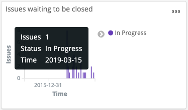
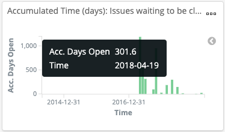

# Understand the Jira Backlog


Roles: Developer, Project Manager

Where: Jira dashboards are available from the **Issue Management** drop-down list.


You are interested in participating in a project, but first, you want to see if the project has an accumulation of uncompleted work that needs to be dealt with in the backlog.

**Do these steps:**

1. Click a **project name** on a project of interest that shows the Jira logo .
2. From the **Issue Management** drop-down list, select **Jira** &gt; **Backlog**. A dashboard focuses on open issues, their accumulated time, and associated organization. For details, see [Jira &gt; Backlog](../view-project-dashboard/technical-trends/project-management/jira.md#backlog).
3. View statistics about open issues in **Open Issues Statistics**. These statistics give you a summary of open issues in the backlog.
4. Look at the data in **Issues waiting to be closed** and **Accumulated Time \(days\): Issues waiting to be closed** to learn about the number of issues by status over time.  
5. Find more information in the dashboard such as who the submitters are and the average days open of the issues that they submit. For example, you might notice a recurring pattern of issues that accumulate in a certain time frame.

This data can help you decide if this is a project in which you want to spend your time.

