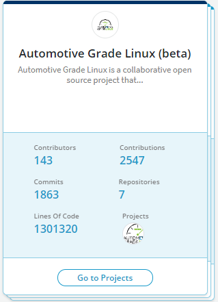

# Dashboard Overview

Insights dashboard shows project and project group cards, in alphabetical order, that show relevant data associated with the project or project group.

1. Go to [https://insights.lfx.linuxfoundation.org/](https://insights.lfx.linuxfoundation.org/).
2. Navigate to a project or project group or type the name in the **Search projects** field for quick search:
3. Click a project to view the project summary page, and click a project group to view projects that belong to the project group.
4. Project group card displays stack of individual projects, and an individual project card displays a single card. 
   * [Project Overview](dashboard-overview.md#project-overview)
   * [Project Group Overview](dashboard-overview.md#project-group-overview)
5. By default, [Summary](project-dashboards/summary.md) dashboard appears. Go to each dashboard. These dashboards are collection of charts and graphs that show you the metrics. The overview dashboards let you monitor many metrics at once, so you can check the health of your projects and see contribution details. For overview of individual data sources, see [Viewing Dashboards](project-dashboards/).
6. Click Copy Short URL  to copy the link of a respective dashboard for a project.
7. Use optional actions:
   * [Select Time Range](filtering-data/select-time-range.md) to view data for a selected time range. Default is **Last 90 Days**.
   * [View Community Leader board](project-dashboards/community-leader-board/)
   * Eliminate data by clicking the corresponding legend **caption**. Click the **caption** again to include the data.  
   * Click **sparklines** to open a bar chart that displays data per calendar period. Following example shows lines of code changed per calendar period.     
   * Click numbers on a data card to view the respective dashboard. Following is an example of Lines of Code Changed:   

### Project Overview

A project is a standalone project maintained by Linux Foundation. Click Go to Overview to navigate to the project summary dashboard.

Each project card shows the following information:

* Project name identifies the project by name.
* Description briefly describes the project. Click the **excerpt** to see the entire description.
* **Contributors** shows the total number of contributors to the project.
* **Contributions** shows the total number of lines of codes that are changed in the project. It includes lines of code added, modified, and deleted.
* **Commits** shows the total number of commits to the project.
* **Repositories** shows the total number of repositories created for the project.
* **Lines of Code** shows total number of lines of code added and modified for the project repository.
* **Data Sources** shows the logos of different data sources, such as  for GitHub and/or Gerrit,  for Jira, or  for Slack, and so on.

### Project Group Overview

A project group is a group of individual projects. Following is an example of a project group that shows an overview of group related data on the card. Click the name to see number of sub-projects under Hyperledger project group.

Each card shows the following information:

* Name of the project group.
* Description briefly describes the project group. When a description shows only an excerpt, click the **excerpt** to see full description.
* **Projects** shows the logos of sub-projects under the project group.
* **Contributors** shows the total number of contributors to the project.
* **Contributions** shows the total number of lines of codes that are changed in the project. It includes lines of code added, modified, and deleted.
* **Commits** shows the total number of commits to the project.
* **Repositories** shows the total number of repositories created for the project.

