# Social Media Metrics

The Social Media Metrics dashboards provide high-level insights from the project's social media accounts and list of target search terms (keywords, hashtags, and so on). Social media metrics are organized into the dashboard types outlined below, which can be viewed by data range, such as 30 days, 90 days, 6 months, and so on. By default, the Twitter Overview page is displayed when you navigate to the project’s social media metrics dashboards.


**Note: **Insights currently supports Twitter data only. Future releases will include data from other social media sources, such as Facebook and LinkedIn, and we will update this page accordingly.


Following are the five Social Media Metrics dashboards for Twitter:

* [Overview](social-media-metrics.md#overview): High-level overview of the project's channel-level performance.
* [Hashtags Summary](social-media-metrics.md#hashtags-summary): Analysis of hashtags included in the project’s twitter posts.
* [Links (URL) Summary](social-media-metrics.md#links-url-summary): Analysis of the URLs included in the project’s social media posts.
* [Languages Summary](social-media-metrics.md#languages-summary): Breakdown of the project’s social media posts by language.
* [Contributors Summary](social-media-metrics.md#contributors-summary): Overview of social media users (contributors or influencers) who are engaged with the project’s social media posts or have mentioned their account.

**No Data Source Configured** appears if a project is not configured for social media metrics analysis. Click **Create Jira Ticket** to provide project related search terms and other details to let Insights provide high-level overview of your twitter account.\
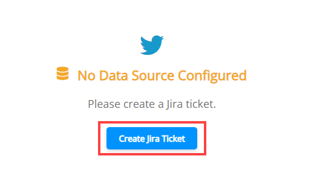

If **Access is available to members of the project** appears:

* Ensure that you have **signed in** to the portal.
* If you have already signed in, then click **Go to My Profile** to update your company information on your profile settings page. Navigate back to the project's social media metrics dashboard and refresh the page. &#x20;

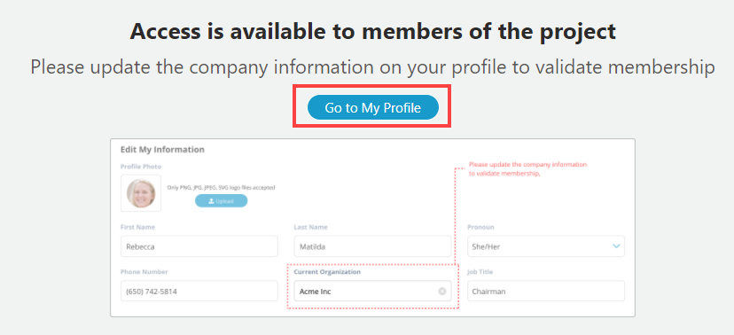

## Overview

It provides a high-level overview of the project’s channel-level performance, including follower metrics, post summary, and a breakdown of top hashtags. Following are the various sections and metrics displayed on this dashboard:


**Section Summaries:** Each section includes a summary of key metrics. These are visualized as metric blocks, which include the following details:

&#x20;

* Name of the metric
* Metric value
* % change over time (based on time range selected)
* Metric results-over-time graph (set in daily increments for the time range selected). Click the mini graph to view detailed results over time.

&#x20;


### **Twitter Insights**

It displays key metrics related to the project’s Twitter accounts, including:

* **Followers:** The total number of followers for the project's Twitter account(s).
* **Following:** The total number of accounts that the project’s Twitter accounts(s) follow.
* **Total Tweets**: The number of tweets published in the selected time range.
* **Total Retweets:** The number of times that tweets posted by the project have been retweeted in the selected time range.

### **Tweets Summary**

It provides an overview of the total and average number of tweets posted over a period of time. Click **View Details** to view detailed information of each metric.

* **AVG TWEETS/HOUR:** Average number of tweets posted per hour in a time range.
* **POTENTIAL IMPRESSIONS/TWEET:** Average number of potential impressions per tweet. Potential Impressions are the total number of views possible (both direct and amplified) for posts with hashtags based on how many timelines your post showed up in.
* **POTENTIAL IMPRESSIONS/HOUR:** Average number of potential impressions per hour for all the tweets posted in a selected time range. Potential Impressions are the total number of views possible (both direct and amplified) for posts with hashtags based on how many timelines your post showed up in.
* **RETWEET RATE: **It is the average rate at which a tweet is retweeted in a time range. It is calculated by dividing the number of total retweets with total tweets posted in a selected time range.

**Tweet Breakdown **displays colored bar graphs that represent the number of tweets and retweets on a periodic basis. Hover over the colors to view the numbers. Click **TWEETS** or **RETWEETS** from the bottom of the graph to filter the graph; click again to remove the filter.

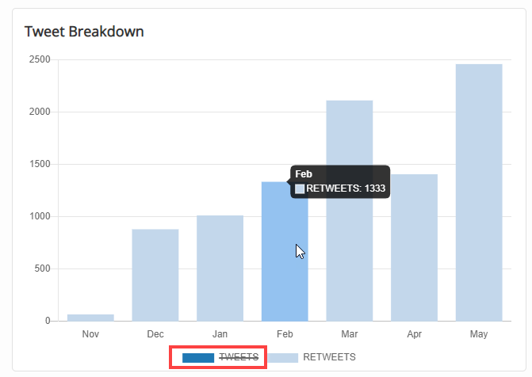

**Top Tweets **displays a table that lists top 10 tweets ordered by potential impressions, and provides details of the tweets.

* **Tweets: **Top 10 tweets that have the most number of impressions. It shows the tweet, the user’s name who tweeted along with the date, and a link to the tweet. Click the link to view details on twitter.
* **Tweet Summary:  **Displays the the following:
  * **Retweets: **Number of times the tweet is retweeted in a time range.
  * **Replies: **Number of replies received on the tweet in a time range.
  * **Potential Impressions:** Displays the total number of views possible (both direct and amplified) for posts with hashtags based on how many timelines your post showed up in. Click **View Breakdown** that displays the following data:
    * **Potential DIR. Impression: **Potential direct impression is the potential of the direct reach of the tweet without it being amplified. It's directly proportional to the number of followers of the twitter profile.
    * **Potential AMP. Impression: **Potential amplified impression is the indirect reach of the tweet. It displays the number of views for the total number of retweets of a tweet. If a tweet is not retweeted, it means it is never amplified, and potential amplified impression displays zero.
    * **Total Potential Impressions:** Sum of both potential direct impressions and potential amplified impressions.

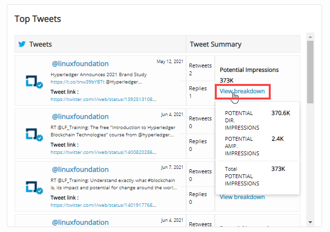

**Likes over time **displays a bar graph that represents the number of likes received on the tweets in a time range. It displays the data on a periodic basis for a selected time range. Hover over the graph to view the number of likes received in that period.\
&#x20;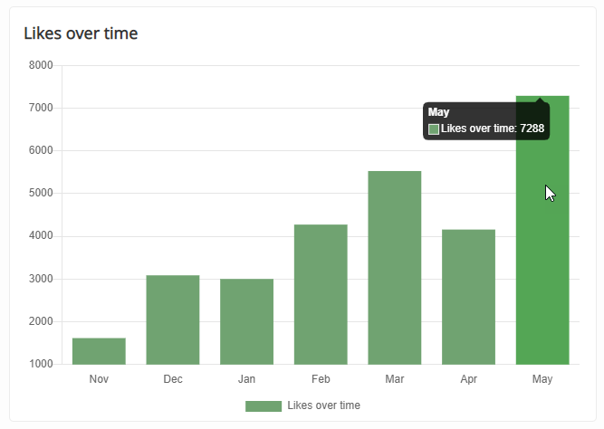&#x20;

**Retweets over time **displays a simple line graph that represents the increase or decrease in number of retweets over time. It displays the data on a periodic basis for a selected time range. Hover over a point in the graph to view the number of retweets in that period.\
&#x20;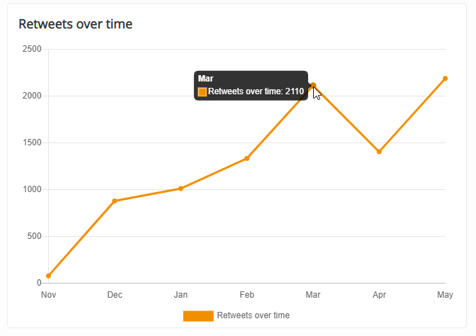&#x20;

**Tweet Frequency **displays a shaded line graph that represents the total number of tweets posted over a time period. It displays the data on a periodic basis for a selected time range. Hover over a point in the graph to view the number of tweets in that period.\
&#x20;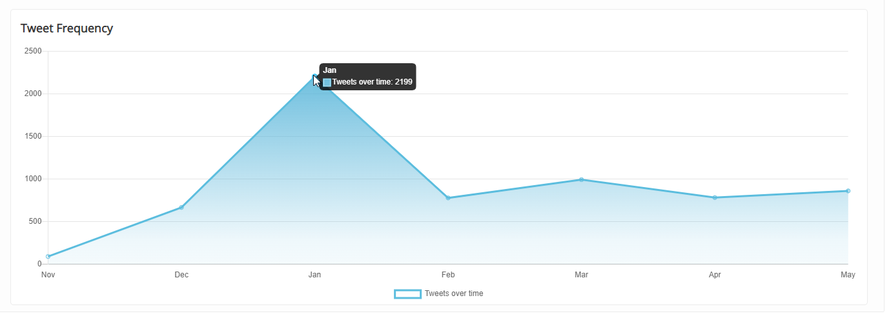

## Hashtags Summary

The dashboard provides an overview of hashtag usage and performance across the project’s Twitter posts and related conversations (i.e., retweets). Click **View Details** to view more information on each metric. Following are the various sections and metrics displayed on this dashboard.

**Hashtags Summary** displays an overview of key metrics related to hashtag usage and performance.

* **# OF HASHTAGS: **Displays the total number of hashtags used in the project’s Twitter posts over a period of time.
* **AVERAGE # OF TWEETS PER CONTRIBUTOR: **Displays average number of tweets posted by a contributor in the time range.
* **# OF CONTRIBUTORS: **Displays total number of users who participated in the conversation, tweet or retweet of the top trending hashtags.
* **POTENTIAL IMPRESSIONS: **Displays the total number of views possible (both direct and amplified) for posts with hashtags based on how many timelines your post showed up in.

**Top Hashtags **displays a cloud of top trending hashtags used in the project’s Twitter posts and related conversations. Hover over a hashtag to view the number of times it has been mentioned in tweets and retweets within the selected time range.\
&#x20;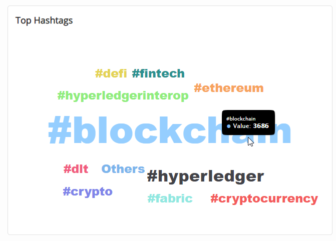

**Top Hashtags Breakdown **displays a pie chart that represents the breakdown of top trending hashtags ordered by percentage and number of times the hashtag is mentioned in tweets and retweets. Hover over a color in the chart to view the hashtag name, and number of times it has been mentioned in tweets and retweets within the selected time range. 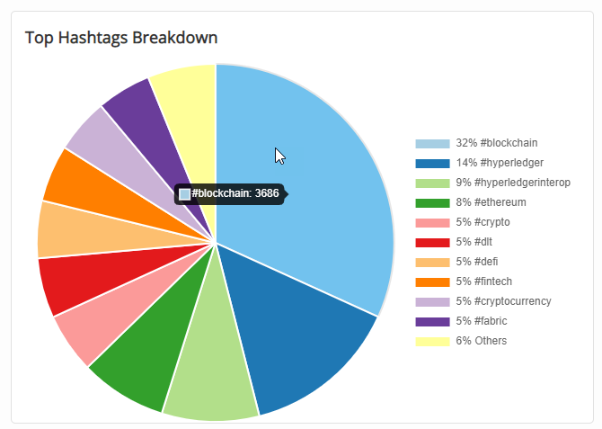

**Top Hashtags **displays a table that lists top trending hashtags ordered by highest potential impressions (includes both direct and amplified impressions). It lists top trending hashtags, total number of tweets, retweets, contributors, and potential impressions for a given hashtag.

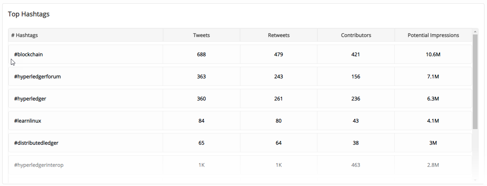

## Links (URLs) Summary

This dashboard provides an overview of link (URLs) usage and performance across the project’s Twitter posts and related conversations (i.e., retweets). Click **View Details** to view more information on each metric. Following are the various sections and metrics displayed on this dashboard.

**Links (URLs) Summary **displays an overview of key metrics related to URLs usage and performance.

* **# OF URLs: **Displays total number of URLs used in the project’s Twitter posts over a period of time.
* **# OF RETWEETS: **Displays total number of retweets of the project’s Twitter posts that include URLs.
* **# OF CONTRIBUTORS:** Displays total number of users who mentioned the URLs in tweets and retweets.
* **POTENTIAL IMPRESSIONS: **Displays the total number of views possible (both direct and amplified) for posts with hashtags based on how many timelines your post showed up in.

**Top URLs By Tweets **show horizontal progress bars that represent the top 10 URLs ordered by number of times they are mentioned in the tweets over a period of time.

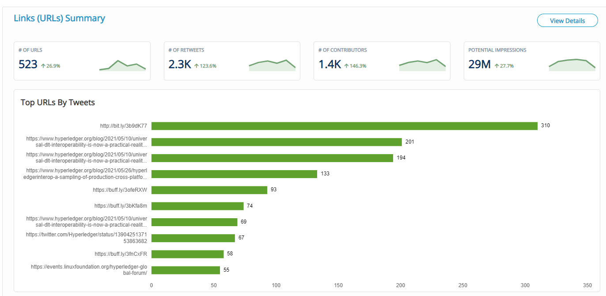

**Top URLs **displays a table that lists top 10 URLs ordered by total number of potential impressions (include both direct and amplified impressions). It provides links to the URLs, displays total number of contributors who tweeted or retweeted the URL along with the number of tweets and retweets by contributors in the time range.

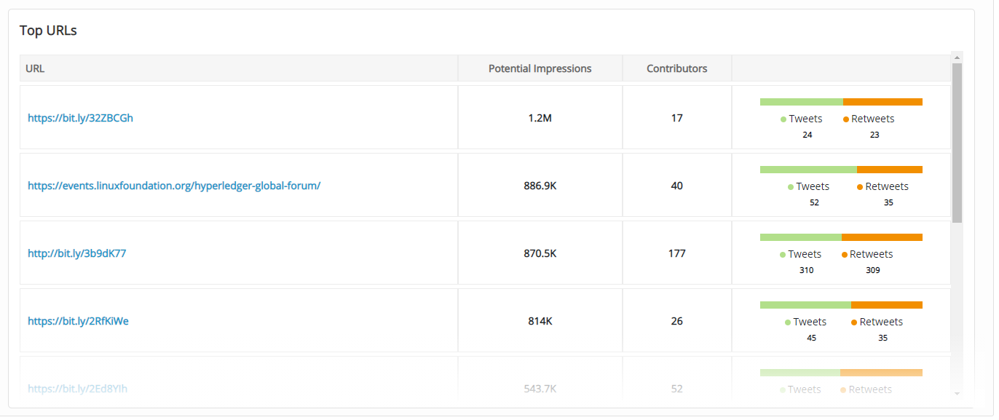

## Languages Summary

This dashboard provides an overview of the languages used across the project’s Twitter posts and related conversations (i.e., retweets), as well as content performance by language. Click **View Details** to view more information on each metric. Following are the various sections and metrics displayed on this dashboard.

* **# OF LANGUAGES: **Displays total number of languages used in the tweets and retweets in a time range.
* **# OF CONTRIBUTORS:** Displays the total number of contributors for the project's Twitter posts over a period of time.
* **POTENTIAL AMP. IMPRESSIONS: **It is the indirect reach of the tweet. If a tweet is not retweeted, it means it is never amplified, and potential amplified impression displays zero.
* **POTENTIAL DIR. IMPRESSIONS: **It is the potential of the direct reach of the tweet without it being amplified. It's directly proportional to the number of followers of the twitter profile.

**Top Languages By Tweets **displays curved line graphs representing the languages that are most used in tweets and retweets over a period of time. Click a language from the bottom of the graph to filter the graph, click again to remove the filter. Hover over a point in the graph to view the number of times a language is used in a time range.

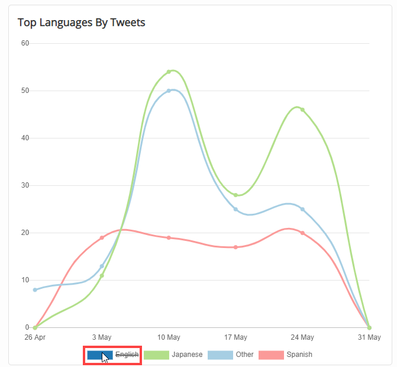

**Languages Impressions** displays a table representing the languages (used in the tweets and retweets) ordered by highest number of potential total impressions over a period of time. It lists the top 10 languages, total number of tweets, retweets, and replies that used the language. It also displays the potential direct impressions and potential amplified impressions for the language over a period of time.\
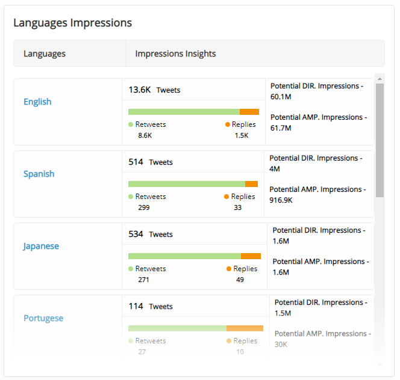

## Contributors Summary

This dashboard provides an overview of social media users (contributors or influencers) who are engaged with the project’s Twitter posts or have mentioned their account. An engagement can be _a like, comment, or retweet_. The various sections and metrics displayed on this dashboard are detailed below.

* **# OF CONTRIBUTORS: **Displays the total number of users (in a time range) who tweeted and retweeted contents related to the project, and replied to the tweets and retweets relevant to  the project. This is calculated by measuring unique engagements, such as likes, comments, or retweets.
* **# OF RETWEETS: **Displays the total number of times the project’s Twitter posts have been retweeted in the time range.
* **AVERAGE # OF TWEETS: **Displays average number of tweets posted in a time range. It is calculated by dividing the total number of tweets with the total number contributors for the time range.
* **# OF POTENTIAL IMPRESSIONS: **Displays the total number of direct and amplified impressions for the tweets and retweets by all the contributors in a time range.

**User Mentions **displays horizontal progress bars that represent the twitter handles that are mentioned the most in the project’s tweets in a selected time range.

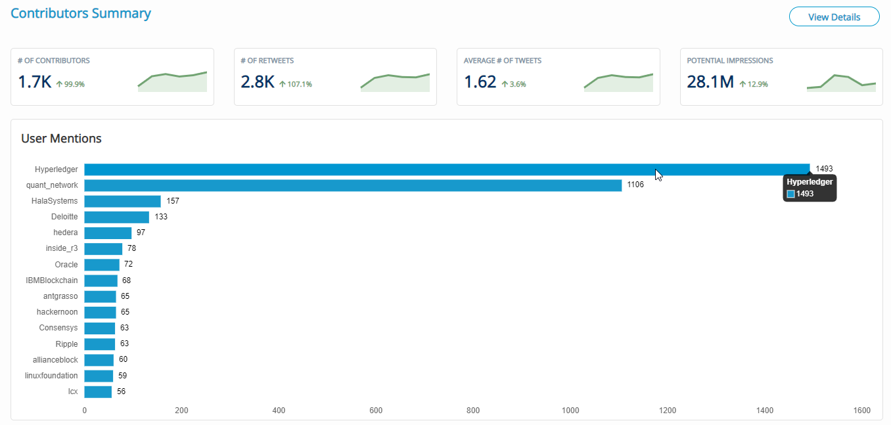

**Top Contributors** displays a table that lists the top 10 Twitter handles ordered by highest number of potential impressions (include both direct and amplified impressions) for the tweets and retweets by that user.

* **Contributors: **Lists the profile names along with the links. Click a profile to navigate to the profile’s twitter page.
* **Contributions: **Displays number of followers of the profile, total number of tweets by the user mentioning the project’s relevant terms, and sum of potential direct impressions of  all the tweets posted in a time range.
* **Engagement: **Displays total number of retweets gained for all the tweets by the user. It also displays the retweet rate by the user. Retweet Rate is the average number of times the user’s posted tweets are retweeted by other users. It is calculated by dividing the total number of retweets with the total number of tweets for a time range.
* **Amplification: **Displays the number of potential amplified impressions, and multiplier values for the tweets and retweets by the user. Multiplier value is calculated by dividing potential amplified impressions with direct impressions for a time range. It is used to interpret by what factor a contributor's tweets are getting amplified.

