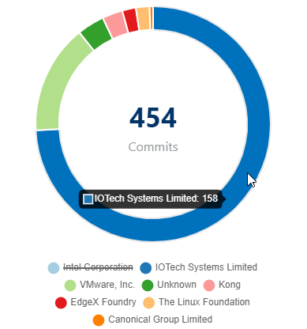
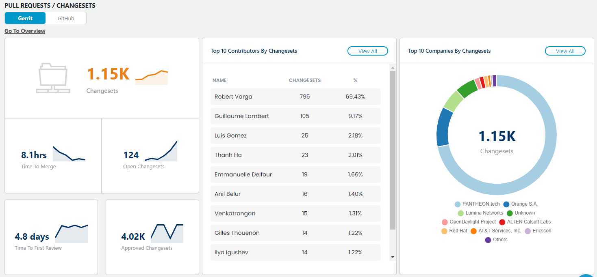
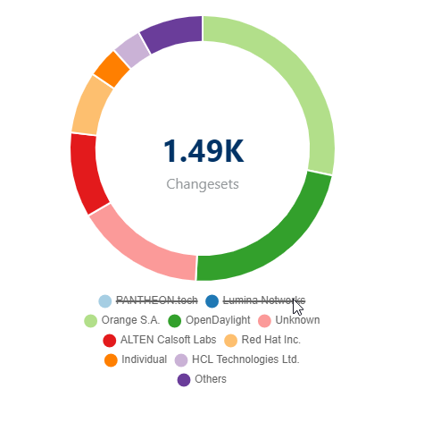

# Summary


By default, Bot commit is filtered, and can't be included for Summary dashboard.


Summary provides a high-level metrics about each data source for which the project is configured. Following are activities for quick navigation:&#x20;

****[**Technical Metrics**](summary.md#technical-metrics)**:**

* [Source Control](summary.md#source-control)
* [Pull Requests / Changesets](summary.md#pull-requests-changeset)
* [Issue Management](summary.md#issue-management)
* [CI/CD](summary.md#ci-cd)
* [Registry](summary.md#registry)

## **Technical **Metrics

Following dashboards are displayed under Technical Metrics:

### **Source Control**

[Source Control](source-control/) shows analytic overview of git commits for a selected time range. Default time range is** Last 90 Days**. You can [select a time range](../filter-data/filter-data-by-time-range.md) to view  data for the selected time range.

* Clicking **Go To Overview** and **View All** takes you to the respective dashboard of [Commits > Overview](source-control/git.md) page.

.png>)

**Commits **shows the following information:

* **Lines Of Code Changed** represents total number of lines changed—added, updated, and deleted—for a selected time range.
* **Commits** represents total number of commits for a selected time range.
* **Contributors** represents the number of contributors for the project
* **No Of Sub Projects** represents total number of sub projects (added git repositories) under a project.
* **Repositories** represents total number of repositories of the project. This includes the number of repositories of sub projects.

**Top 10 Contributors By Commits **lists the top ten individuals—that contribute most to the project— by name, total number of lines of codes changed that includes lines of codes added and modified, number and percentage of commits. Click **View All** to navigate to the [Commits > Overview](source-control/git.md) page.

**Top 10 Companies By Commits **shows a doughnut chart that represents** **top ten companies that contribute most to the project.

Mouse over a color in the chart to view company name and number of commits made by the company. Click a company name to exclude company data. Click again to add the company data. Following is an example:\
&#x20;&#x20;


* **Unknown **as a company name shows number/percentage of codes submitted by those contributors who are not affiliated with any organization.
* **Others **represents a group that combines all other companies that come after top nine companies that contributes more.


### **Pull Requests / **Changeset

[Pull Requests/Changesets](pull-request-management/) shows analytic overview of pull request information of GitHub repositories and/or information about changesets and patchsets per changeset for Gerrit.


Data is not available for a Git data source that is not configured for  Insights.


**Gerrit **shows total number of changesets (both open and closed), number of open changestes, average time in hours to merge changesets, average time in days for first review of changeset, and total number of approved changesets for a selected time range.

* Clicking **Go To Overview** and **View All** under **Gerrit** takes you to the respective table/graph/chart of [Gerrit Changesets > Overview](pull-request-management/gerrit-changeset.md#overview) section.

**GitHub** shows total number of pull requests (both open and closed), number of open pull requests, average time in hours to merge pull requests, and average time in hours pull requests were open for a selected time range.

* Clicking **Go To Overview** and **View All** under **Gerrit** takes you to the respective table/chart/graph of [GitHub PR > Overview](project-management/github-issues.md#overview) section.

**Top 10 Contributors By PRs **(for GitHub)** **or** Top 10 Contributors By Changesets **(for Gerrit)** **lists the top ten individuals—that contribute most to the project— by name, total number of pull requests or changestes, and percentage of commits out of the total number of commits by the community.

**Top 10 Companies By PRs **(for GitHub)** **or** Top 10 Companies By Changesets **(for Gerrit)** **shows a doughnut chart that represents** **top ten companies that contribute most to the project.

* Mouse over a color in the doughnut chart to view company name and number of commits made by the company.&#x20;
* Click a company name to exclude company data. Click again to add the company data. Following is an example:\
  &#x20;


* **Unknown **as a company name shows number/percentage of codes submitted by those contributors who are not affiliated with any organization.
* **Others **represents a group that combines all other companies that come after top nine companies that contributes more.


### **Issue Management**

[Issue Management](project-management/) shows analytic overview of issue management platforms used by a project, such as Jira, GitHub Issues, and Bugzilla.

**Jira** shows total number issues that includes both open and closed issues, total number of submitters, number of open issues, average time in days the issues are open, and time in days for which a stacked area chart compares the number of issues and unique contributors per calendar period.

* Clicking **Go To Overview** and **View All** under **Jira** takes you to the respective table/chart/graph of [Jira > Overview](project-management/jira.md#overview) section.

**GitHub Issues** shows total number issues that includes both open and closed issues, total number of submitters, number of open issues, average time in days the issues are open and average time in days the issues took to be resolved.

* Clicking **Go To Overview** and **View All** under **Github Issues** takes you to the respective table/chart/graph of [GitHub Issues > Overview](project-management/github-issues.md#overview) section.

**Bugzilla** shows total number issues that includes both open and closed issues, total number of submitters, number of open issues, total time in days the issues are open, and time in days issues took to be closed.

* Clicking **Go To Overview** and **View All** under **Bugzilla** takes you to the respective table/chart/graph of [Bugzilla > Overview](project-management/bugzilla.md#Bugzilla-Bugzilla>Overview) section.

**Top 10 Contributors By Issues Submitted** lists the top ten individuals— that contribute most to the project— by name, total number of issues, and percentage of issues out of the total number of issues submitted by the community members.

**Top 10 Companies By Issues Submitted shows a doughnut chart that represents **top ten companies that contribute most to the project.

Mouse over a color in the doughnut chart to view company name and number of commits made by the company. Click a company name to exclude company data. Click again to add the company data. Following is an example:\
&#x20;&#x20;


* **Unknown **as a company name shows number/percentage of issues submitted by those contributors who are not affiliated with any organization.
* **Others **represents a group that combines all other companies that come after top nine companies that contributes more.


Following an example of Issue Management overview section for a project that uses Jira, GitHub Issues, and Bugzilla to manage issues:

.png>)

### **CI/CD**

[CI/CD](ci-cd/)** **shows an analytic overview of the number of total builds, jobs, failed builds, job categories, and average build duration in minutes. Clicking **Go To Overview** and **View All** under **CI/CD **takes you to the respective table/chart/graph of [Jenkins > Overview](ci-cd/jenkins.md#overview) and [CircleCI > Overview](ci-cd/circle-ci.md#overview) sections respectively.

**Top 10 Jobs **lists the top ten jobs by name, number, and percentage.

**Build Results** for Jenkins and **Jobs Results** for CircleCI shows a doughnut chart that represents total number of builds for all the build results, such as Success, Failure, Unstable, and Aborted. Click a result to exclude the data. Click again to include.

### **Registry**

[Registry](registry/) shows total number of median pulls, average stars for images, increase number in pull count, and star counts for DockerHub. Clicking **Go To Overview** and **View All** opens the respective table/chart/graph of [Docker > Overview](registry/dockerhub.md#DockerHub-DockerHub>Overview) section.

**Top 10 images By Pull Count **lists the top ten pulls by name, number, and percentage.

**Top 10 images By Star Count **lists the top ten stars by name, number, and percentage.

