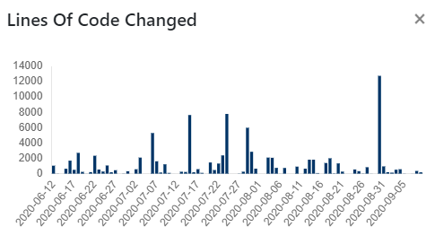

# View Project Dashboard

* [Project Group](./#project-group)
* [Project Summary or Project Group Summary](./#project-project-group-summary)

Refer the following for refining data for summary page and individual data sources:

* Click Copy Short URL  to copy the link of a respective dashboard for a project.
* [Select Time Range](../filter-data/select-time-range.md) to view data for a selected time range. Default is **Last 90 Days**.
* [View Community Leader board](community-leader-board/)
* [View Identities and Affiliations](../identities-and-affiliations/)
* Eliminate data by clicking the corresponding legend **caption**. Click the **caption** again to include the data.  
* Click **sparklines** to open a bar chart that displays data per calendar period. Following example shows lines of code changed per calendar period.     
* Click numbers on a data card to view the respective dashboard. Following is an example of Lines of Code Changed:   
* Select a value from the drop down to quickly navigate to the respective section on Summary dashboard:  
* While navigating from top to bottom on Summary dashboard, click  on the down right corner to reach to the top of the page.

## Project Group

Project group dashboard shows individual projects that come under the project group, and a metrics card that shows metrics, such as total number of contributors, contributions, commits, repositories, lines of code added and modified, total number of mentions, messages, and so on for all the projects under the group.

* Click a [project](./#project-project-group-summary) to navigate to the project [summary](summary.md) page.
* Type a project name in **Search project within** field to search for a project within the project group.
* Click Go To Overview below project group name to navigate to the [project group summary](summary.md) page.

## Project / Project Group Summary

When you navigate to a project's dashboard, by default the [Summary](summary.md) page appears that displays overview of the project's data sources. The Summary page is divided into two groups: ****[Technical Trends](./#technical-trends) and [Ecosystem Trends](./#ecosystem-trends). Navigate to each to learn more about the data sources.

#### Technical Trends:

Data for Technical Trends is displayed for all the projects, and shows details for the following data sources:

* [Source Control](summary.md#source-control)
* [Pull Request Management](pull-request-management/)
* [Issue Management](summary.md#issue-management)
* [CI/CD](summary.md#ci-cd)
* [Registry](summary.md#registry)

#### Ecosystem Trends:

Ecosystem trends is displayed if 

* [Chat Room](summary.md#chat-room)
* [Mailing List](summary.md#mailing-list)
* [Documentation](summary.md#documentation)
* [Earned Media](summary.md#earned-media)

**View Community Leaderboard:** Click [Community Leaderboard](community-leader-board/) from top right corner to view [Active Community Contributor board](community-leader-board/active-community-contributor-board.md).

**View Identities & Affiliations:** After you sign in as an administrator, you can view Identities & Affiliations beside Community Leaderboard if you have access to the project. If you don't have access, click **Request To Edit Affiliations** from navigation bar to request for access. Click **Identities & Affiliations** to [view and manage](../identities-and-affiliations/) contributors' affiliations.

