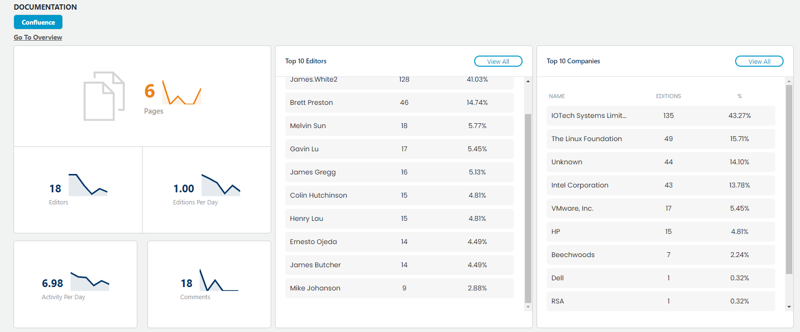
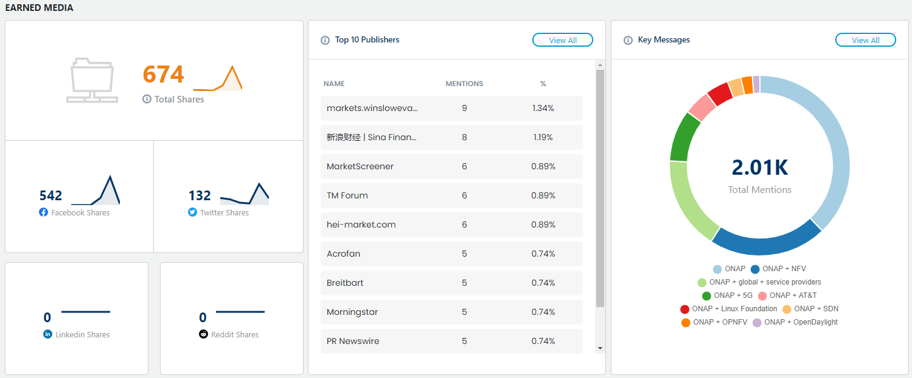

# Summary


By default, Bot commit is filtered, and can't be included for Summary dashboard.


Summary provides a high-level metrics about each data source for which the project is configured. Following are activities for quick navigation:

* [Chat Room](summary.md#chat-room)
* [Mailing List](summary.md#mailing-list)
* [Documentation](summary.md#documentation)
* [Earned Media](summary.md#earned-media)

### **Chat Room**

[Chat Room](chat-room/) ****shows an analytic overview of Slack and RocketChat channels used by a project.

**Slack** shows total number of messages, channels, participants, replies, and reactions over time. Clicking **Go To Overview** and **View All** under **Slack** takes you to the respective table/chart/graph of [Slack &gt; Overview](chat-room/slack.md#overview) section.

**RocketChat** shows total number of messages, channels, participants, replies, and reactions over time. Clicking **Go To Overview** and **View All** under **RocketChat** takes you to the respective table/chart/graph of [RocketChat &gt; Overview](chat-room/rocket-chat.md#overview) section.

**Top 10 Message Senders** lists the top ten individuals—who communicate most in the project— by name, number of messages, and percentage of messages out of the total number of messages shared by the community.

**Top 10 Channels** lists the top ten slack channels where most amount of communication is happening. It shows the channel name, number of messages per channel, and percentage of messages per channel. Following is an example of chat room dashboard:

### **Mailing List**

[Mailing List ](mailing-list/)shows an analytic overview of email communication channels, such as Groups.io or Pipermail:

**Groupsio** shows total number of emails, groups, companies, authors, and average number of messages communicated over time.

**Google Groups** shows a richer context around how frequently the community is interacting. ****Project community managers can use metrics like “Daily Active Users”, “Emails by Organization”, and even “Top Trending Topics” to better engage and acknowledge their community members. For detail metrics, see [Google Groups](mailing-list/google-groups.md).

**Piper Mail** shows total number of emails, mailing lists, companies, authors, and average number of messages communicated over time.

**Top 10 Email Senders** lists the top ten individuals—who communicate most in the project— by name, number of emails, and percentage of emails out of the total number of emails shared by the community.

**Top 10 Mailing Lists** lists the top ten email lists where most number of communication is happening. It shows the list name, number of emails per list, and percentage of emails per list. 

### **Documentation**

[Documentation](documentation/) shows an analytic overview of project's [confluence](documentation/confluence.md) pages for a selected time range. It shows total number of confluence pages created/edited, total number comments in the form of feedback or conversation on confluence pages, total number of editors who contributed to create/edit or provide feedback/comment on the confluence pages, and average number of editors per day.

**Top 10 Editors** lists the top ten individuals— who makes most number of edits/updates— by name, number of pages edited by the individual, and percentage of contribution out of the total document contribution by the community members.

**Top 10 Companies** lists the top ten companies— that contribute most to the project— by name, total number of editions, and percentage.

### Earned Media

[Earned Media](earned-media/) shows analytic overview of how many times consumers \(unique users\) searched, mentioned, and shared project related articles or blogs  on different media platforms, such as facebook, linkedin, blog sites, news publishing websites, and so on. The data includes various metrics, such as geographical data, sentiment analysis, SEO metrics, social media sharing/mentions, publishers, and so on.

**Total Shares** shows how many times a project's search results are shared by consumers on different social media platforms. This also shows number of shares on individual social media platforms.

**Top 10 Publishers** lists top ten media houses and blog sites that mention most about the project in the form of articles and blog posts. It includes the number and percentage of mentions about your project.

**Key Messages** shows a doughnut chart that displays how many times the project and its competitors' search results are mentioned by consumers \(unique users\). Mouse over a color in the chart to see the number of mentions for a project out of the total mentions. For example, Linux Foundation is mentioned 4.88k times by consumers on different media platforms out of the total 6.52k times including its competitors' mentions as per the following data.

