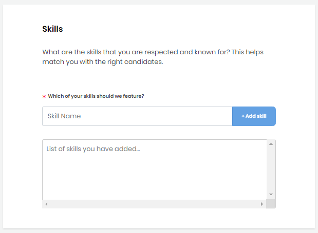
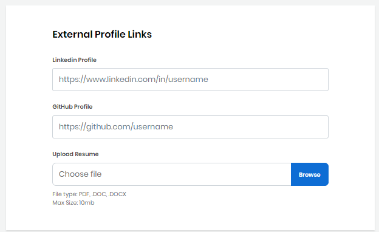

# Become a Mentor

1. To become a mentor for a mentorship program [Sign in](../../../../sso/sign-in/) to [Mentorship](https://people.communitybridge.org/) and click on **Become a Mentor** navigation menu item to [Create a mentor profile](./), and request to be [added ](request-to-be-added-to-a-program.md#to-apply-to-a-project)to a program.

Keep these items ready before you begin:

* Your LinkedIn profile web address
* Your GitHub profile web address
* Your resume in a PDF, DOC, or DOCX format
* An image file for your avatar in JPG, PNG, SVG format with a maximum size of 2 MB
* \(Required\) Information about that project for which you like to mentor individuals: project name, project repository URL, and project administrator name and email

2. Complete the form fields.  
**Note:** Red asterisks indicate required fields. A bar at the top of the page shows your progress as you click **Next** through the form. Click any of the following links for information about fields.

* [User Information](./#CreateaMentorProfile-MentorProfile)
* [Introduction](./#CreateaMentorProfile-Introduction)
* [Skills](./#CreateaMentorProfile-Skills)
* [External Profile Links](./#CreateaMentorProfile-ExternalProfileLinks)
* [Mentorship Project Details](./#CreateaMentorProfile-ProjectDetails)
* [Terms and Conditions](./#CreateaMentorProfile-TermsandConditions)

3. Select the checkbox and click **Submit**. Click on **My Profile** navigation menu item to view and edit your profile.  
  
**Note:** The Project Admin of the mentorship program you requested to be added to as a mentor will review your profile before you're added to the program. 

**See:**  [Manage Account](../../administrators/manage-your-account.md)

### User Information 

Provide your first name, last name, email address, phone details, and upload your image in the respective fields. The Linux Foundation uses your contact information for corresponding with you.

Some fields are pre-filled with your Linux Foundation account values. Use an avatar \(image\) to represents yourself. Your avatar appears on your mentor's card under Mentees. Click **Browse** to upload a JPG, PNG, or SVG file. Preview shows the image that you uploaded.

### Introduction 

Introduce yourself to project administrators and inform them why you would excel as a mentor for a project.

### Skills 

Click in the **Skill Name** filed, select a skill, and click **+Add skill** to add your current skills.

### External Profile Links 

Showcase your experience by providing links to your external profiles pages, and upload your resume file. Your external profile links will appear on your mentor card in Mentorship.

### Mentorship Project Details 

This is not a mandatory field while creating a mentor profile.

Click in the field, type a project name or select from the drop-down list, and click **+Add Project**. Your request is added with status **Requested**. 

**Withdraw Request** lets you withdraw your application.

After the project maintainer adds you to the project, you will get an email notification informing that you are added to the project, and the status changes to **Added**.

### Terms and Conditions 

Read the Terms and Conditions, and select the checkbox.

