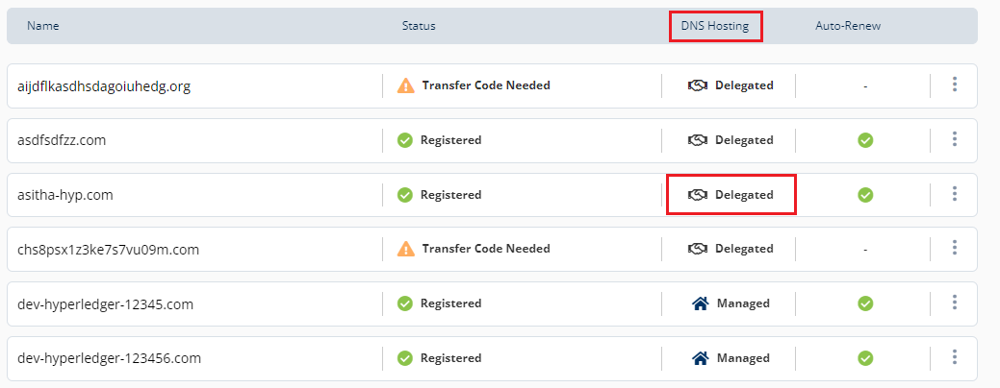
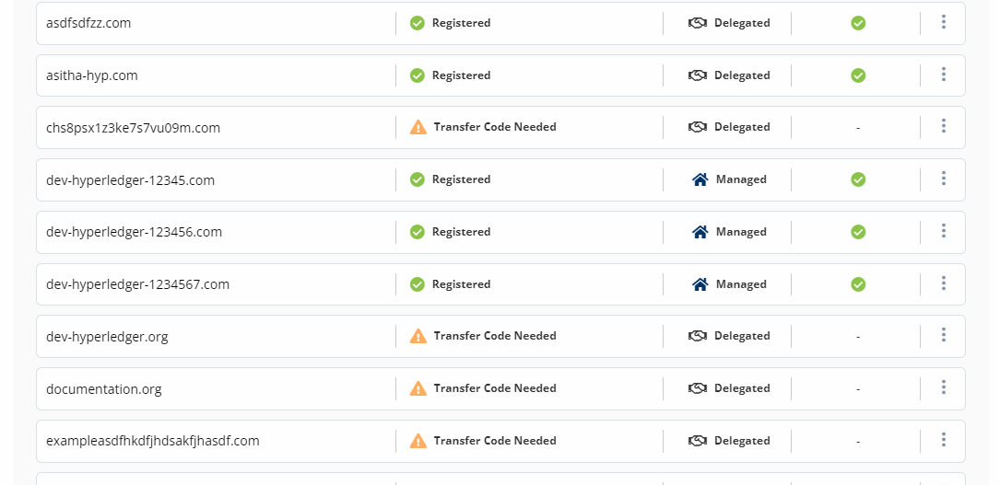

# Setting up a Domain for a Project

A domain name provides a unique identity for your project. You can set up a unique domain name that will allow you to have a administrative autonomy as well as control within the internet world.

To setup a domain for the project, perform the following steps:

1.Login into PCC.

2\. Search for the required project. The Project dashboard appears. Click **Domains** from the **IT SERVICES STATUS** tab.


You can also navigate to Domains from the Vertical Sidebar navigation menu. Click **IT Services** and then select **Domains**.


3.The Domains page appears. Click **+ Add Domain** to add a domain for your project.


You cannot change the primary domain for the project, if you want to change the primary domain, you need to raise a support ticket.



You can update the domains details by click of the edit .png>) icon.


4.The Add Domain dialog box appears. Enter the **Domain Name** and click the **Check Availability** button.

5.The domain will be searched and checked against the following points:

* The domain is already owned by the project that's being setup
* The domain is already owned but by another project (when the project name unknown)
* The domain is already owned but by another known project.

6.If the domain name is available, a green tick mark is displayed next to the **Domain Name**. Click the **Register Domain** button to register the domain. Refer Register Domain for more details.

7.If the domain is already taken by an another project, you have the option to bid for that domain. Refer Bid Domain for more details.


You should have the domain setup for a project in order to setup other IT Services such as Mailing List, Wiki, Issue Tracking, and Email Forwarding services.


## Setting up Primary Domain

You can setup a primary domain for a project within the available and registered domains for a project.

To setup a primary domain for a project, perform the following:

1.Go to the Domains page for the required project. The domain page appears with the list of domains registered with the project.

2.Place the cursor in the **Search Domain** box, select the required domain and click the **Set As Primary Domain** button.

3.The domain will be selected and listed as Primary Domain.

## Redirecting a Domain

You can redirect a domain from one domain to another. Redirects are a way to forward visitors and search engines to a different URL than the one they requested. You can use redirects when you’re moving content around and you want the content to retain its value.

To redirect a domain from one domain to another domain, perform the following:

1.Go to the Domains page for the required project. The domain page appears with the list of domains registered with the project.

2.Click .png>) icon available under Manage pane.

3.The Edit Domain dialog box appears. Click **Redirects**, enter the redirect domain under **To** box and click **Add**.

4.The redirected domain is listed under **Existing Redirects** list.


If you want to update the redirect domain, click the edit  icon.

If you want to delete the redirect domain, click the delete icon.


## Adding a Service Record

You can add service record such as Pantheon, Netlify and GitHub pages for your domain.

To setup service record, perform the following steps:

1.Go to the Domains page for the required project. The domain page appears with the list of domains registered with the project.

2.Click .png>) icon available under Manage pane.

3.The Edit Domain dialog box appears. Click **Services**, select the required Service from the list and click **Add**.

4.The service records are listed under **Existing Service Records** list.

## Transfer Domain

As a administrator, you can transfer the domains which are owned outside your project. You can transfer such domains to your projects.&#x20;

To transfer a domain, perform the following:

1.Click **+ Add Domain**.&#x20;

.png>)

2.The Add Domain dialog box appears. Enter the name of the domain that you want to transfer to your project and click **Check Availability**.&#x20;

.png>)

3.You can see the Domain Taken message.  Click Yes; Transfer Domain. &#x20;

.png>)

4.One more message appears that informs you whether Linux Foundation should manage your DNS. Select Yes or No.&#x20;

5.You can import the DNS Zone file or skip it, if you do not have it. Click **Save and Continue**.&#x20;

6.The Domain will be listed in your project with status **Transfer Code Needed**.

.png>)


You have to provide the transfer code in order to complete the domain transfer. To provide the transfer code, click icon and select **Continue Transfer** and enter the transfer code that you will receive from the registrar of your domain. Select My Domain is unlocked and My DNS Service is not hosted and click **Begin Transfer**.&#x20;


## Delegate DNS

Domain Name System (DNS) is the hierarchical and decentralized naming system used to identify computers, services, and other resources reachable through the internet or other internet protocol networks. DNS converts human readable domain names to machine readable IP addresses.&#x20;

DNS Delegation is nothing but providing rights from one resource to another resource. Delegations allows the servers in one zone to refer clients to servers in other zones.

Administrator can delegate the DNS for the managed DNS.&#x20;

To delegate the DNS through PCC, perform the following:

1.Go to the Domains list and click the  icon and click **Delegate DNS (no managed DNS)**.&#x20;

2.The Delegate DNS server pop box appears. Provide the required **Name Servers** and select the **I Understand** statement and click **Delegate**.&#x20;


You can provide the details of the six name servers.&#x20;


3.A flyer message appears informing that the DNS delegation is success and under DNS Hosting, the managed status changes to **Delegated**.&#x20;


Administrator can stop the delegation of the DNS, click icon and select **Stop Delegating DNS ( use Managed DNS)**. A confirmation message appears, click **Yes**.&#x20;


