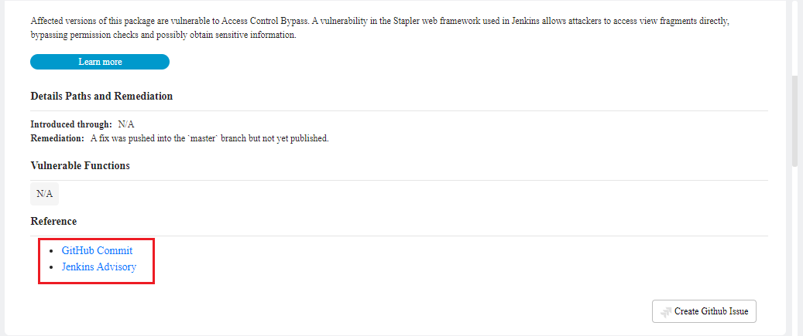

# Authorization Page

The authorization page allows you to authorize your account in order to view issues related to your projects.&#x20;


You have to authorize your account only once when your logging into Security to view issues for the first time. For the subsequent login, you need not have to validate your account.&#x20;


You can validate your account by logging as:

* Contributor/Mentor
* Member&#x20;

## Authorizing your Account as Contributor/Mentor

If you are a contributor or mentor of the project, perform the following steps to validate your account to view issues related to your project:

1.On a project card of interest, click **View Issues**.

2.The Authorization page appears. Click **Connect to GitHub**.&#x20;

3\. The Authorization window between GitHub and Linux Foundation appears. Click** Authorize linuxfoundation**.&#x20;

4.Provide the username and password of your GitHub account. Your GitHub account is now connected.&#x20;


You can also connect the GitHub account using My Profile, see [My Profile](https://docs.linuxfoundation.org/lfx/my-profile/linking-social-accounts) for more details.&#x20;


5.If your a contributor or maintainer of the GitHub account, a green tick mark appears and **Continue as Contributor/Mentor** button is enabled. Click the **Continue as Contributor/Mentor** to view issues relate to the project.&#x20;

If your not a contributor or mentor,  a red tick mark appears along with a message informing that your not a contributor or maintainer for the project.&#x20;


Click **Change **to change the GitHub account.&#x20;


## Authorizing your Account as a Member

You can login as a member of the project to view issues. You have to setup your organization details in your individual dashboard using My Profile. Based on the organization that you have setup in My Profile, the screens varies when you try to access the issues as a member login.&#x20;

In order to view issues, your organization should be the member of the Linux Foundation. If your organization does not have the membership associated with Linux Foundation, you will see a message that informs that your organization does not have project membership.&#x20;

### Organization Details Missing in My Profile&#x20;

If you have not added your organization details in My Profile, perform the following steps to authorize your account as a member:


For more information on adding organization details in My Profile, see [Organization Details](https://docs.linuxfoundation.org/lfx/my-profile/managing-your-profile).&#x20;


1.On a project card of interest, click **View Issues**.

2.The Authorization page appears. Select the required organization from the **Organization Name** drop-down list and provide the associated email belonging to the organization in the **Your Organization Email** field.&#x20;

3.The **Send Code** button is enabled, click **Send Code** to get the authorization code. You will receive the authorization code in the registered email ID. Enter the code and click **Continue with Member Access **to view project issues.

### Organization Details Available in My Profile&#x20;

If you have added your organization name in My Profile along with the email ID, perform the following steps to authorize your account as a member:

1.On a project card of interest, click **View Issues**.

2.The Authorization page appears along with the organization name that is available in My Profile. The email ID is auto populated in the Your Organization Email field. Click **Continue with Member Access **to view project issues.


You cannot edit the email ID. You can change the organization if needed by click of **Change**.&#x20;


&#x20;
