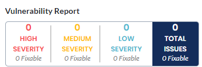
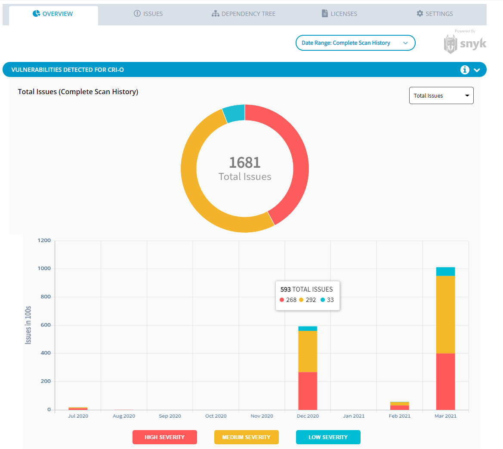
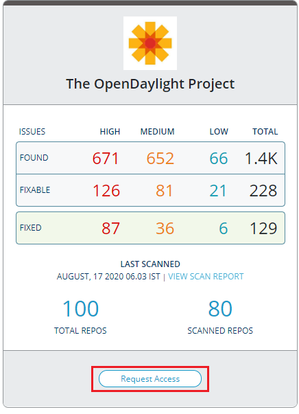
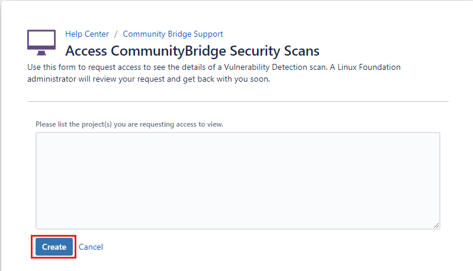
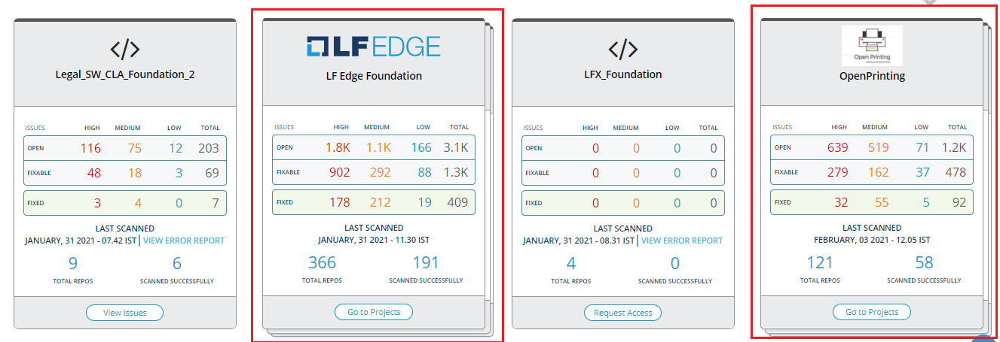

# Open LFX Security

LFX Security detects vulnerabilities in LFX projects. Projects that are part of the LFX receive free daily scans through the LFX Security service in order to detect vulnerabilities in code repositories as well as library dependencies. LFX projects include a Vulnerability Report, which gives an overview of vulnerability severities. 


Only project maintainers can access Vulnerability Detection details to gain visibility into open security issues and paths to remediation.


As a project maintainer, you can access vulnerability scan details for projects based on the LFX service you opted while enrolling your project:

* [Projects applied to LFX Funding](open-lfx-security.md#projects-applied-to-lfx-funding)
* [Projects applied to LFX Security](open-lfx-security.md#projects-applied-to-lfx-security)

**Note:** If you are not a project maintainer and/or not authorized to see vulnerability report for a project, you can [request access](open-lfx-security.md#requesting-access-to-view-vulnerability-report) to see vulnerability scan details.

### Projects applied to LFX Funding

To see vulnerability scan details for projects from LFX Funding:

1.[Sign In](../sso/sign-in/) to [LFX Funding](https://funding.lfx.linuxfoundation.org/) website.

2.From dashboard, click a **project** of interest or click **My Projects** to see your projects.


You can also search for the required project, using the Search box.


3.A dashboard shows various aspects of the project including a Vulnerability Report.

4.Navigate to the Vulnerability Report card, and click a **severity level**.  
**Note:** Log in if a Login Now prompt appears.  
  
    
  
LFX Security appears and shows the Overview dashboard. 

5.Access other dashboards by selecting a menu name to investigate vulnerabilities by using the data in the dashboards

### Projects applied to LFX Security

To see vulnerability scan details for projects applied to LFX Security:

1.[Sign in](../sso/sign-in/) to  [LFX Security](https://security.lfx.linuxfoundation.org/) website.  
A dashboard shows various aspects of the project, and a Vulnerability Report.  

2.Click **My Projects** to see your projects.

3.On a project card of interest, click **View Issues**.


The **View Scan Report** provides  you the scan details of the repositories and link to access those repositories along with scan error details.


4.The Overview page appears with the details for the selected project. 

### Requesting Access to view Vulnerability Report

If you are not authorized to see vulnerability report for a project, **Not Authorized** pane appears when you click **Contributor Login** on a project of interest. To request access:

1.Click **Request Access**.

2.The Not Authorized dialog box appears. Click **Request Access**. 

3.The LFX Security help center request form opens. Enter the details and click **Create**.


LFX support team reviews your request and informs you about your access permission.


### Foundation Project Groups

A Foundation project group is a group of individual projects. Normally Foundation group hosts group of projects in a single Foundation project.

A Foundation  project with group of individual projects are displayed as shown in the following image:

#### View Individual Projects in the Foundation Project

You can view the individual projects that are stacked in the Foundation project and check the issues related to the individual projects.  

To view the individual projects, perform the following steps:

1.Click **Go to Projects** from the Foundation project. 

2.The Security Summary is displayed along with the list of Individual project cards. The following Project Summary details are listed:

* Repositories Successfully Scanned
* Projects Successfully Scanned
* Projects Partially Scanned
* Issues Open
* Fixable Issues 
* Issues Fixed
* Languages 
* Upstream Dependencies 
* Types of Licenses Found


The warning  icon provides information on why the security scan is failed for the repositories. 


3. You can also check the issues related to the individual project by click of **View Issues**. 


You might see **Request Access**, if you do not have the access to the project. 


## Security Leaderboard

Security Leaderboard is a type of dashboard that provides prominent statistics related to LFX Security. The Security Leaderboard provides the following information related to the LFX Security:

* Scanned repositories,  vulnerability detected and fixed and also the recommended fixes
* Top 10 Most Impactful Fixable Vulnerabilities
* Top 10 Projects Most Active in Fixing Vulnerabilities
* Top 10 Projects by Repositories Scanned

### Scanned Repositories, Vulnerabilities and Fixes

The Security Leaderboard dashboard provides overview information on the repositories, vulnerabilities and fixes. The following statistical information is available for repositories, vulnerabilities and fixes:

* Number of scanned repositories
* Number of vulnerabilities detected in the repositories
* Number of recommended fixes provides for the detected vulnerability 
* Number of fixed vulnerabilities 

### Top 10 Most Impactful Fixable Vulnerabilities

Top 10 most impactful fixable vulnerabilities list shows you the top 10 fixable vulnerabilities along with the repositories impacted with the vulnerabilities, CVE and CWE. This list auto scrolls when you hover over the mouse on the list.

### Top 10 Projects Most Active in fixing vulnerabilities

Top 10 projects most active in fixing vulnerabilities list shows you the top 10 projects  that have actively fixed the detected vulnerabilities. The list provides you the project name and the number of vulnerabilities fixed. This list auto scrolls when you hover over the mouse on the list.

### Top 10 Projects by Repositories Scanned

Top 10 projects by repositories scanned list shows you the top 10 projects with the highest number of repositories scanned in the project. The list provides you the project name and the number of repositories scanned for the project. This list auto scrolls when you hover over the mouse on the list.

 

 

  

