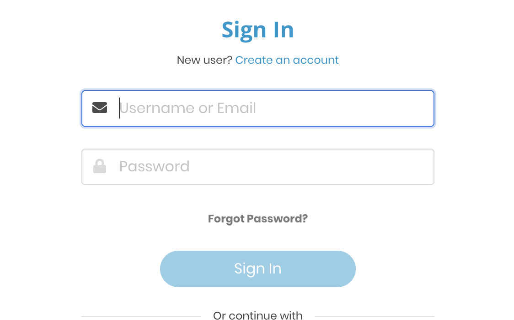
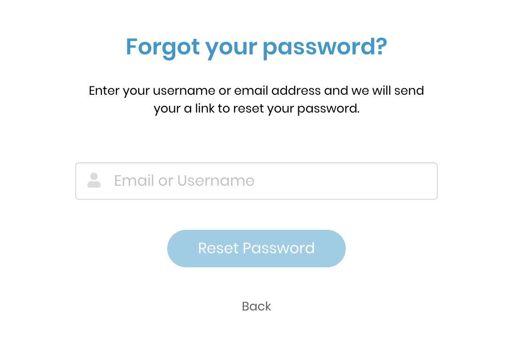
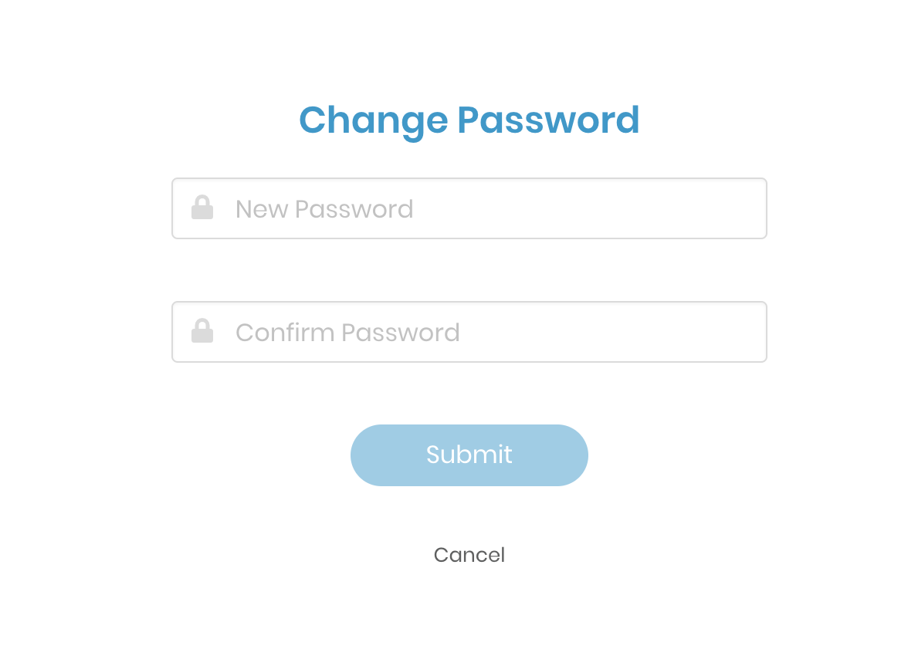

# Forgot Password

If you do not remember your SSO account password, you can make a request to reset your password.

**Note:** A password change invalidates any of your active sessions for the protected services that you are currently logged in to and you will need to sign in again.

1. On the SSO page, simply click the **"Forgot Password?"** link.​​
2. Enter your email address or username and click **Reset Password**. 

   ​ 

3. An email should be sent to the inbox of the email address you have on file as associated with your SSO account. In case you don't have access to the email address on file anymore, you can provide a desired email address, where you need the link to reset your SSO account password. You should see a notification as below:                    

4. Please Check your email inbox for a `The Linux Foundation: Reset Password` email and open it.

5. Click **Reset Password**.

The Change Password window appears:                      ​​

Enter a new password and confirm it. Click **Submit**. The status bar confirms that your password is updated.

