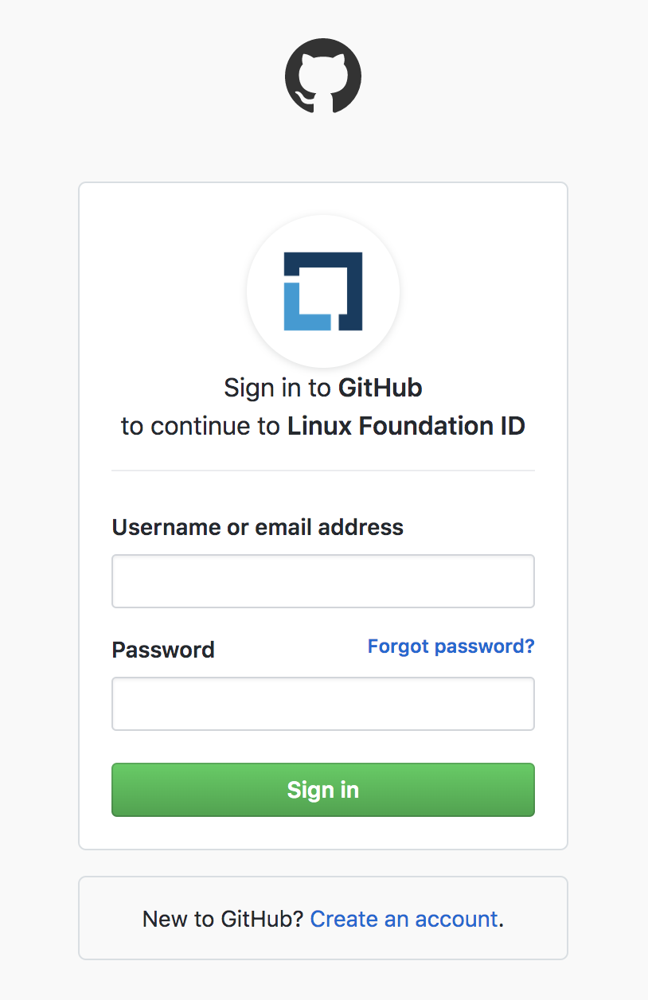

# Sign in with GitHub

You can use your GitHub login credentials to sign in to the protected Linux Foundation service instead of creating an LF account. The first time you sign in, you will enter your GitHub credentials to authenticate your GitHub account. Subsequent logins will not require you to enter the credentials⏤you will simply click the **GitHub** icon to sign in. This one-click approach simplifies your login process.

## To Sign in with GitHub: 

1. On the **SSO page**, click the GitHub icon to continue to Sign in with GitHub.         

2. The Sign in to GitHub page appears.                          

3. Enter your GitHub user credentials and click **Sign in**.


Two-factor authentication page appears if your account has Two-factor authentication turned on. Based on your choice of delivery mechanism, you may receive this code via SMS, email or text on your device. 


                                              

4. After verifying your code, you can access the protected Linux Foundation service. If you already have a new or existing Linux Foundation SSO account, Linux Foundation maps your SSO account to the social/3rd party login.

5. If you do not have an SSO account created earlier, then the **Create an account** page appears.                                                                           

6. Enter a username, and click **Create Account**.  
You will be re-directed to the Linux Foundation service page that you are trying to access.


This username will be your new SSO Account Username, and will be synced with your email address.


