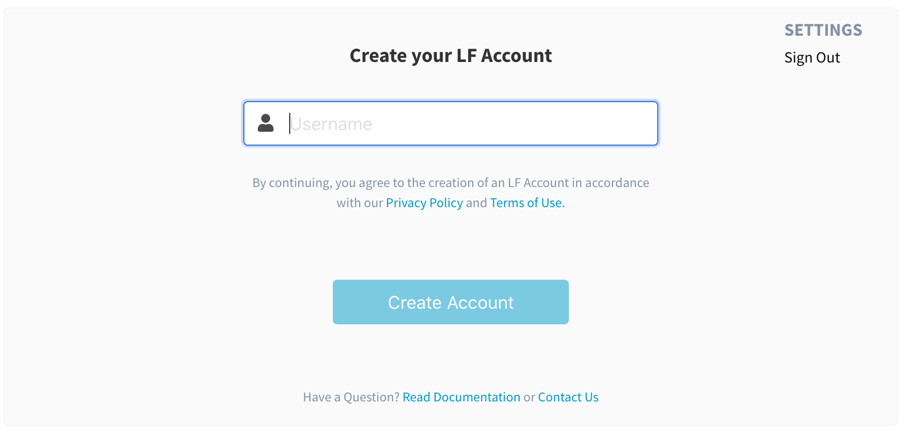

# Sign in with GitHub

You can use your GitHub login credentials to sign in to the protected Linux Foundation service instead of creating an LF account. The first time you sign in, you will enter your GitHub credentials to authenticate your GitHub account. Subsequent logins will not require you to enter the credentials⏤you will simply click the **GitHub** icon to sign in. This one-click approach simplifies your login process.

## To Sign in with GitHub: 

1.  On the **SSO login page**, click on the GitHub icon to sign in with your GitHub account.

2.  Enter your GitHub login credentials and click on **Sign in** CTA icon.             


You will be presented with the two-factor authentication page if your account has two-factor authentication turned on. Based on your choice of delivery mechanism, you may receive authentication code via email or text on your device. 


                                              

4. After entering the authentication code, you will be able access the Linux Foundation service. If you already have an existing LF account, the Linux Foundation will map it to your GitHub login.

5.  If you don't have an LF Account associated with the email address you're using, you will be navigated to **Create your LF Account** page.                                                                                

6. Enter username, and click on **Create Account** CTA button. You will be redirected to the Linux Foundation service page that you are trying to access.


This username will be your new LF Account username, and will be synced with your email address.


