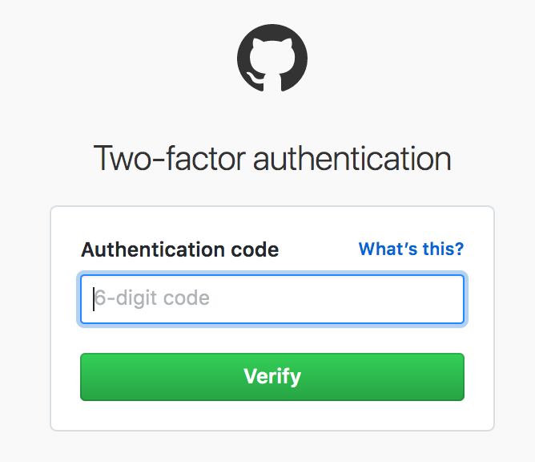

# Sign in with GitHub

You can use your login credentials from GitHub to Sign in to the protected Linux Foundation service instead of creating a SSO account. The first time you sign in, you would enter your GitHub credentials to authenticate your GitHub account. Subsequent logins would not require you to enter your credentials⏤you simply click the **GitHub** icon to sign in. This one-click approach simplifies your logins. 

## To Sign in with GitHub:. 

1. On the **SSO page**, click the GitHub icon to continue to Sign in with GitHub.         
2. The Sign in to GitHub page appears.                          
3. Enter your GitHub user credentials and click **Sign in**. You may be presented a screen to provide your authentication code, if your account has Two-factor authentication turned on. Based on your choice of delivery mechanism, you may receive this code via SMS, email or text on your device.                                                        
4. Thats it! Upon verifying your code, you should be able to access the protected Linux Foundation service. 

Note: Signing in with your GitHub account also automatically generates a system designated SSO account name for you and associates your GitHub account with it.

