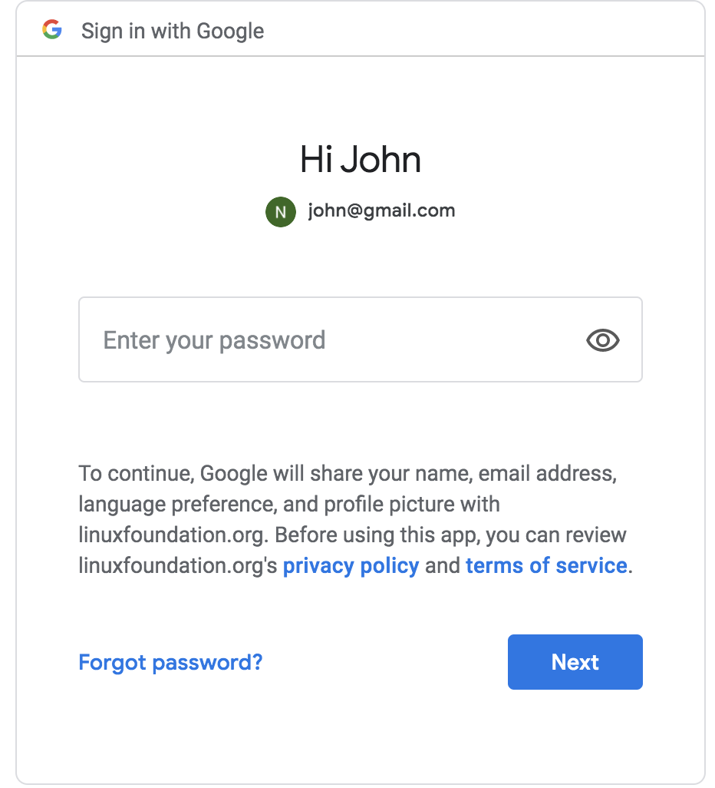

# Sign in with Google

You can use your login credentials from Google \(gmail\) to Sign in to the protected Linux Foundation service instead of creating a SSO account. The first time you sign in, you would enter your Google credentials to authenticate your Google account. Subsequent logins would not require you to enter your credentials⏤you simply click **Login with Google**. This one-click approach simplifies your logins.

## To Sign in with Google  

1. On the **SSO page**, click the Google icon to continue to Sign in with Google. 
2. Provide email address and click **Next.**                     
3. Provide password and click **Next**.                             
4. If you do not have an SSO account associated with the email address that you just entered, then the **Create an account** page appears. 
5. Enter a username, and click **Create Account**.  **Note:** This username will be your new SSO Account Username, and will be synced with your email address.

