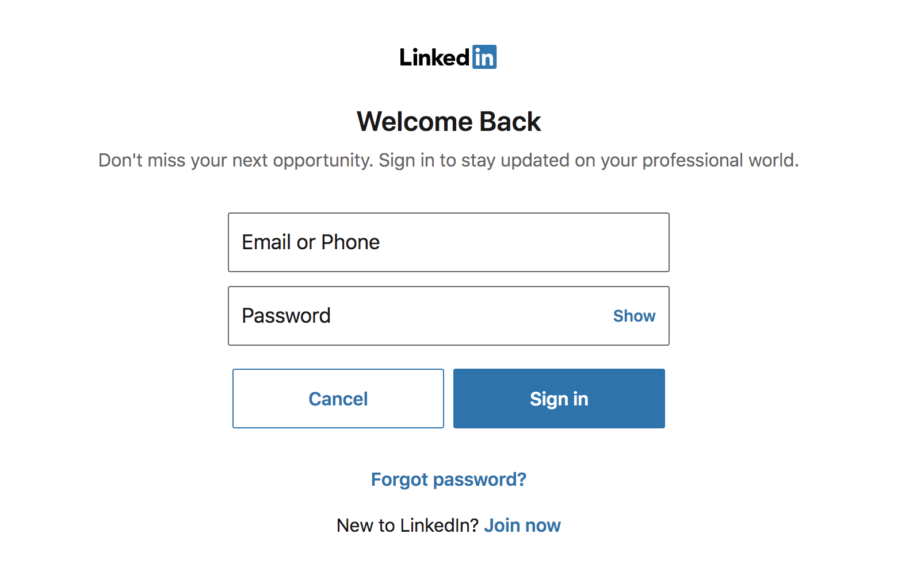
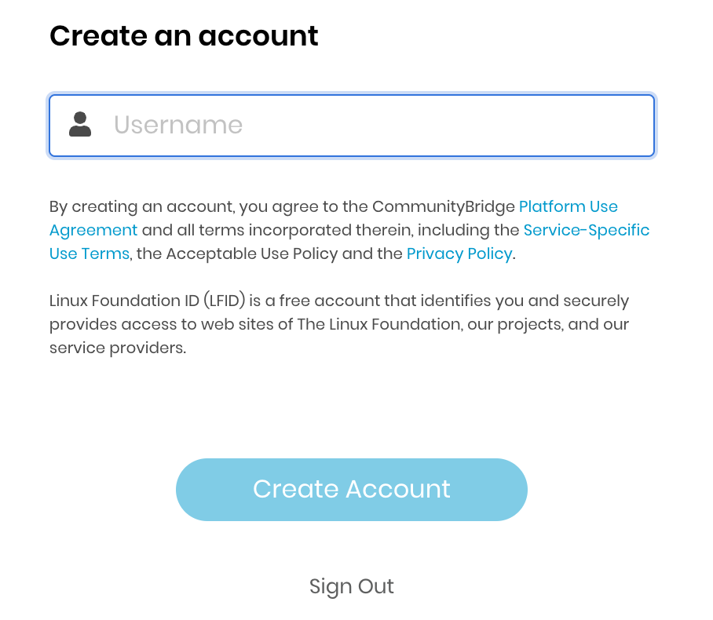

# Sign in with LinkedIn

You can use your Linked login credentials to Sign in to the protected Linux Foundation service instead of creating an SSO account. The first time you sign in, you would enter your LinkedIn credentials to authenticate your LinkedIn account. Subsequent logins would not require you to enter your credentials⏤you simply click the **LinkedIn** icon to sign in_**.**_ This one-click approach simplifies your logins.

## To Sign in with LinkedIn: 

1. On the **SSO page**, click the LinkedIn icon to continue to Sign in with LinkedIn.         

2. Enter your LinkedIn account credentials, and click **Sign in**.      

4. If you have an existing Linux Foundation SSO account, Linux Foundation maps your SSO account to the social/3rd party login, and you can access the protected Linux Foundation service. If you do not have an SSO account created earlier, then the **Create an account** page appears.                                                                          

5. Enter a username, and click **Create Account**.  
You will be re-directed to the Linux Foundation service page that you are trying to access.


This username will be your new SSO Account Username, and will be synced with your email address.


